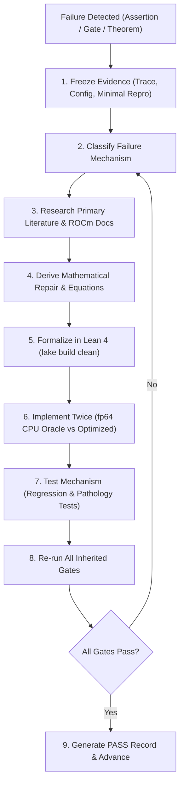

# Algebraic Intelligence Autonomous Phase Protocol

Every numbered phase must obey this protocol. A phase prompt plus this file is the complete operating instruction; later phases inherit all earlier gates.

## 1. Non-Negotiable Objective

Build, falsify, and scale the **Algebraic Stack** architecture defined in `theory.md`. Do not replace it with an easier generic transcendental architecture or introduce hybrid compromises that violate the foundational axiom.

The defining invariant of this research is the **Zero-Transcendental Axiom**:
$$\text{No } e^x, \quad \text{No } \ln(x), \quad \text{No } \sin(x), \quad \text{No } \cos(x), \quad \text{No continuous exponential EMAs}, \quad \text{No cosine schedules.}$$

Every forward pass, backward pass, activation function, variance normalization, attention score, relative positional encoding, loss functional, divergence, mixture-of-experts routing, and optimizer update must consist solely of rational operations $(+, -, \cdot, /)$, polynomial compositions, and a single hardware-native algebraic radical:
$$\operatorname{rsqrt}(z) = \frac{1}{\sqrt{z}} \quad (z > 0).$$

The twelve load-bearing architectural primitives that must be rigorously constructed, formally verified, and empirical-stress-tested are:
1. **Algebraic Linear Unit (ALU):** $K(x) = \frac{x}{2}(1 + u)$ with cached $u = x \cdot \operatorname{rsqrt}(x^2 + 1)$, closed-form Horner cubic backward $K'(x) = \frac{1}{2}(1 + 2u - u^3)$, inflection point at $x = -\sqrt{2}$, and global Lipschitz constant $L_K \approx 1.04433$.
2. **Algebraic Variance Normalization (AVN):** Zero-parameter projection $\hat{\mathbf{x}} = \mathbf{x} \cdot \operatorname{rsqrt}(m_2(\mathbf{x}) + \epsilon)$, eliminating the $d$-dimensional learnable scale vector $\boldsymbol{\gamma}$ from HBM, strictly satisfying the Coupling Identity $\beta(x; v) = \beta(\hat{x}; 1)$.
3. **Algebraic Softmax (A-Softmax):** $\mathbf{S}_n(\mathbf{s})_i = \rho(\hat{s}_i)^n / (\sum_j \rho(\hat{s}_j)^n + \Omega)$ with kernel $\rho(x) = x + \sqrt{x^2 + 1}$, sharpening exponent $n = 8 = 2^3$ evaluated via 3 hardware squarings, globally 2-Lipschitz, uniform diagonal Jacobian bound $\le n/4 = 2.0$, routing contrast $> 10^5$ on bounded logits, and rational attention sink $\Omega \ge 0$.
4. **Octo-Algebraic Cross-Entropy (OACE / $\mathcal{L}_{1/8}$):** Strictly proper scoring rule $\mathcal{L}_{1/8}(p_k) = 8(p_k^{-1/8} - 1)$ evaluated via 3 sequential $\operatorname{rsqrt}$ operations, with strictly bounded gradient $8 p_k^{-1/8}$, eliminating the logarithmic pole.
5. **Algebraic Divergence (AD):** Strictly proper Pearson $\chi^2$ divergence $D_A(\mathbf{y} \| \mathbf{p}) = \sum y_i^2 / p_i - 1$, Fisher information metric equivalence $\nabla^2 D_A|_{\mathbf{p}=\mathbf{y}} = 2 \nabla^2 D_{\text{KL}}|_{\mathbf{p}=\mathbf{y}}$, and bounded gradients under AVN pre-bounding.
6. **Algebraic Geometric Ordering (AGO):** Static skew generator $\mathbf{A}_k = \omega_k \mathbf{J}$ on $\mathfrak{so}(2)$, rational Cayley transform $\mathbf{R}_k = (\mathbf{I} + \omega_k \mathbf{J})(\mathbf{I} - \omega_k \mathbf{J})^{-1}$, unimodular $\mathrm{SO}(2)$ rotation ($\det = 1$), exact relative shift equivariance $\langle \mathbf{Q}_m, \mathbf{K}_n \rangle = f(n - m)$, and $\mathcal{O}(1)$ autoregressive decode updates via 4 FMAs.
7. **Algebraic Attention (AA):** Dual-track attention combining local windowed A-Softmax with global linear associative memory updated via an ALU delta rule, with contractive stability $\|\mathbf{S}_t\|_F < \infty$.
8. **Algebraic FlashAttention (AFA):** Strictly positive kernel $\rho^8$ enabling pure additive tile accumulation without running-max subtraction $\exp(m_{\text{old}} - m_{\text{new}})$, and single-pass lock-free asynchronous Ring Attention via a single global AllReduce.
9. **ALU-GLU:** Feed-forward network $\mathbf{W}_d [(\mathbf{W}_g \mathbf{x}) \odot K(\mathbf{W}_u \mathbf{x})]$ with polynomial backward graph in cached $u$ and universal approximation certificate.
10. **Algebraic Mixture of Experts (A-MoE):** AVN-bounded $\rho^8$ routing with Algebraic Noise Transform (ANT) inverse-CDF sampling $\eta = (2U - 1)/\sqrt{1 - (2U - 1)^2 + \epsilon_n}$, native FP4 routing, and structural anti-collapse via $(1 + \hat{r}_j^2)^{-1/2}$ gradient attenuation.
11. **Algebraic Curvature Optimizer (ACO):** Factorized $\mathcal{O}(d_{\text{out}} + d_{\text{in}})$ curvature preconditioning $\hat{\mathbf{V}}_{ij} = \sqrt{\hat{r}_i \hat{c}_j}$, rational momentum and polynomial debiasing, Algebraic Rational Decay Schedule (ARDS) $\eta_t \propto \operatorname{rsqrt}(1 + \alpha t^2)$, and $\mathcal{O}(1/\sqrt{T})$ non-convex convergence.
12. **Algebraic Byte Algebra (ABA) & AIP:** Patch-pooled byte representations with constant $\mathcal{O}(1)$ typo shatter vs BPE $\Omega(\sqrt{L})$, and Algebraic Information Preservation (anti-roughness power iteration, anti-dimensional collapse $\|\mathbf{C} - \mathbf{I}\|_F^2$, and AVN repulsive field).

---

## 2. Evidence Hierarchy

Use current files, raw execution logs, serialized tensors, checkpoints, and hardware-level measurements as authoritative evidence. Treat prose, theoretical expectations, and prior passing reports as hypotheses until reproduced.

1. **Primary Sources:** Cite mathematical papers, official AMD ROCm/HIP documentation, IEEE/SIAM numerical standards, and verified code implementations. For every external reference, record URL, version, access date, assumptions, and the exact architectural decision supported.
2. **Raw Output Primacy:** A terminal log or JSON metric artifact is authoritative over markdown claims. If prose says "perplexity ratio $\le 1.08$" but the raw json shows $1.42$, the phase is **FAILED**.
3. **No Cosmetic Relabeling:** Never relabel old transcendental runs as algebraic data. Stale experiments whose equations do not match the current algebraic formulation must be archived or deleted.
4. **Hardware Measurements:** All systems metrics (throughput, latency, memory bandwidth, VRAM footprint) must be measured with explicit GPU synchronization on the target AMD Instinct MI300X GPU (`gfx942`).

---

## 3. Mandatory Failure-Repair Loop

Whenever any assertion, Lean proof, numerical tolerance, training loss criterion, parity threshold, or inherited gate fails, the autonomous agent must execute this strict 9-step loop:

1. **Freeze the evidence.** Save the failing configuration, seed, execution command, environment fingerprint, raw traceback, metrics, and the smallest reproducible test case. Never overwrite or hide a failing run.
2. **Classify the failure.** Select and explicitly justify one or more root causes:
   - *Implementation bug* (index error, transposed tensor, missing factor);
   - *Numerical conditioning* (ill-conditioned denominator, precision loss in float16/bfloat16, un-damped residual growth);
   - *Hardware/Kernel* (ROCm compiler bug, register spilling on CDNA3 Wave64, LDS bank conflict, memory alignment);
   - *Optimizer/Data* (learning rate warmup too short, rational decay parameter $\alpha$ miscalibrated, bad batch size);
   - *Representation pathology* (rank collapse in feature charts, attention entropy collapse);
   - *Model misspecification* (algebraic formulation lacks necessary degrees of freedom);
   - *Theorem/Assumption mismatch* (mathematical proof relies on premise violated in implementation);
   - *Evaluator error* (test harness measures wrong quantity or uses invalid tolerance);
   - *External resource* (corrupted dataset download, Hugging Face rate limit).
3. **Research before patching.** Search primary mathematical literature, official AMD ROCm documentation, and numerical analysis texts. Add the cited sources and extracted formulas to the research log. Blind hyperparameter tuning is strictly forbidden.
4. **Derive a repair.** Write down the complete equations, invariants, predicted quantitative effect, valid operational domain, and a counterexample outside that domain. If the original theoretical claim was flawed, correct `theory.md` and the claim registry; never silently weaken a theorem or alter an empirical metric.
5. **Formalize the repair.** Add or update a faithful Lean 4 statement in `formal/AlgebraicTheory/` for every deterministic algebraic claim that is formalizable. Run `/root/.elan/bin/lake build`. A proof-script failure is an engineering issue; a mathematical counterexample or missing premise is a theoretical defect.
6. **Implement twice where feasible.** First implement in an independent fp64 CPU reference path with immutable state. Then implement in the production eager or kernel-accelerated path. The two implementations must not share helper functions in a way that creates false agreement.
7. **Test the mechanism.** Add a targeted regression test that fails before the repair and passes after it. Include pathology stress tests and verify that the predicted quantitative effect matches the observed effect.
8. **Run all inherited gates.** A repair that resolves the current phase but breaks any gate from an earlier phase is immediately rejected.
9. **Iterate.** Repeat from step 1 until every current and inherited phase gate passes cleanly.

---

## 4. Gate Amendment Discipline

A gate may change **only** when preserved empirical evidence proves that its underlying scientific claim is false or its evaluation harness is mathematically invalid.
- Never lower a threshold because a training run is slow, expensive, or disappointing.
- Never delete a test because it is difficult to pass.
- When an amendment is scientifically justified: version the gate, retain the historical failing evidence, update `theory.md`, `README.md`, and Lean coverage, and replace the gate with a stricter, more faithful test of the corrected claim.
- If an actual external blocker (e.g. unresolvable hardware defect, unavailable dataset) halts progress, report the blocker with exhaustive documentation and leave the phase in a failed state; **do not manufacture a synthetic PASS**.

---

## 5. Reproducibility Contract

1. **Deterministic Pinning:** Pin random seeds across Python, NumPy, and PyTorch (`torch.manual_seed`, `torch.cuda.manual_seed_all`). Pin dataset shard hashes, tokenizer versions, and model configuration dataclasses.
2. **Environment Recording:** Every execution must log Git commit hash, dirty working-tree status, exact CLI command, UTC timestamp, wall-clock duration, hardware identifiers (`AMD Instinct MI300X VF`), ROCm/HIP version, PyTorch version, active dtype, and peak VRAM.
3. **The fp64 Oracle Standard:** Double precision (`torch.float64`) on CPU is the authoritative numerical ground truth. Reduced-precision implementations (FP32, BF16, FP16, FP4) are evaluated strictly against the fp64 oracle under condition-aware tolerances:
   $$\text{Tolerance}(\kappa) = C \cdot \epsilon_{\text{mach}} \cdot \kappa.$$
4. **Hardware Timing Discipline:** Systems benchmarking on the MI300X must call `torch.cuda.synchronize()` before and after timed loops. Warmup iterations and compilation passes (`torch.compile`) must be timed and reported separately from steady-state execution.
5. **Full Seed Disclosure:** Report results across all configured random seeds, including failing, diverging, or non-finite runs. Selective cherry-picking of favorable seeds is scientific misconduct.
6. **Equal-Budget Discipline:** Head-to-head comparisons against transcendental baselines (Transformer, Mamba/SSM) must maintain strict budget equivalence: identical parameter count ($\pm 3\%$), identical training tokens, identical batch size, identical context length, and identical optimizer tuning opportunity.
7. **Lock-Box Test Sets:** Never use test sets or downstream benchmark evaluations to redesign an architecture within the same experimental generation. If architectural changes are made, increment the generation counter and rerun all baseline and candidate models across all seeds.

---

## 6. Formal Verification Contract (Lean 4)

1. **Zero-Axiom Compilation:** `/root/.elan/bin/lake build` must compile cleanly with zero errors, zero warnings, zero `sorry`, and zero `admit`.
2. **No Unreviewed Axioms:** Proofs must not introduce ad-hoc axioms or cheat tactics (`axiom cheat : False`). Only standard Lean 4 and Mathlib4 foundational axioms are permitted.
3. **Faithful Formalization:** Formal definitions in Lean must match Python implementations identically. Do not prove a trivial weakened statement and cite it as verification of a strong claim.
4. **Proof Coverage Registry:** Maintain `formal/PROOF_COVERAGE.md`, detailing exactly what each Lean lemma proves, which hypotheses are required, and what remains an empirical or asymptotic property.

---

## 7. Target Substrate Contract: AMD Instinct MI300X (ROCm / HIP)

1. **Hardware Specification:** The primary execution target is the dedicated AMD Instinct MI300X GPU (CDNA3 architecture, `gfx942`, 192 GB unified HBM3 memory, 5.3 TB/s memory bandwidth).
2. **ROCm/HIP Exclusivity:** Use ROCm toolchains (`HIP 6.2+`, `hipcc`, AMD Clang, AMD Triton).
   - PyTorch reuses `torch.cuda` API namespaces on ROCm; this is expected and allowed.
   - NVIDIA CUDA toolkits, `nvcc`, CUDA-specific wheels, and proprietary CUDA libraries (cuBLAS, cuDNN) are strictly forbidden.
   - Detect ROCm via `hasattr(torch.version, 'hip') and torch.version.hip is not None`.
3. **CDNA3 Architectural Exploitation:** Custom kernels (AFA) must exploit CDNA3 Wave64 vector architecture (`warp_size = 64`), Local Data Share (LDS), and VGPR allocation to eliminate serialization barriers.

---

## 8. PASS Record Contract

Each phase officially concludes only when a generated report `results/phaseN/PASS.md` is committed, containing:
1. Complete list of phase gates and the exact relative paths to their direct empirical or formal evidence;
2. Unabridged reproduction commands that can be executed from a fresh shell;
3. Complete ledger of failed iterations, root-cause classifications, and applied repairs;
4. Theoretical and mathematical adjustments made to `theory.md`;
5. Lean 4 theorem additions, modifications, and lake build logs;
6. High-resolution figures and tabular metric summaries (mean $\pm$ SEM, 95% CIs);
7. Git commit hash, working-tree dirty status, and hardware/environment fingerprint;
8. Explicitly acknowledged limitations that remain open questions for future phases.

Only after `results/phaseN/PASS.md` is written and verified may execution proceed to Phase $N+1$.
