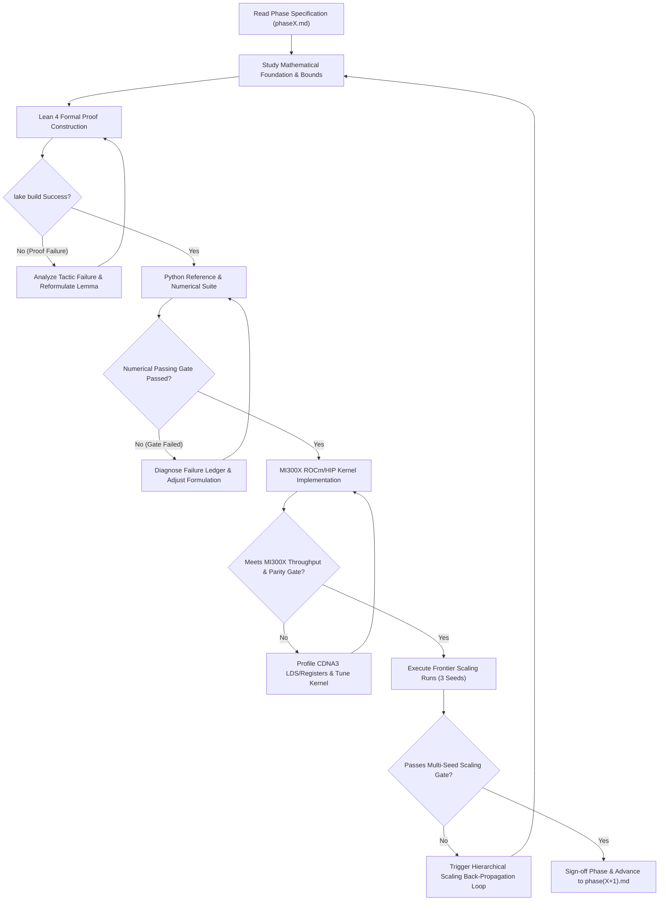

# Autonomous Agent Protocol: The Algebraic Stack

This directory contains the operational execution blueprints and automated verification gates for the **Algebraic Stack** research project.

The ultimate research objective is singular and uncompromising:
$$\textbf{Can algebra and algebra alone give rise to intelligence?}$$

We mandate a **Zero-Transcendental Axiom**:
$$\text{No } e^x, \quad \text{No } \ln(x), \quad \text{No } \sin(x), \quad \text{No } \cos(x), \quad \text{No continuous exponential EMAs}, \quad \text{No cosine schedules.}$$
Every layer, activation, attention score, positional rotation, loss divergence, and optimizer update must consist solely of rational operations, polynomial compositions, and a single hardware-native algebraic radical: $\operatorname{rsqrt}(x) = 1/\sqrt{x}$.

---

## 1. Target Hardware Environment: 1x AMD Instinct MI300X (ROCm / HIP)

All agents executing these phases must know and build for the specific hardware environment available on this machine:

- **Accelerator:** 1x AMD Instinct MI300X GPU (CDNA3 architecture, `gfx942`).
- **Memory Capacity:** **192 GB HBM3** with **5.3 TB/s** peak memory bandwidth.
- **Compute Stack:** ROCm / HIP toolchain (`HIP 7.15+`, `hipcc` at `/opt/rocm/bin/hipcc`, AMD Clang).
- **Kernel Backends:** AMD Triton (`triton-amdgpu`) and native HIP C++ PyTorch extensions.
- **Hardware Architecture Advantage:**
  - With **192 GB of high-bandwidth memory on a single socket**, both the 125M and 350M models, complete batch tokens (2048 context length), and factorized ACO optimizer state fit comfortably in local VRAM with zero distributed pipeline stalls.
  - In later phases (Phase 6–9), the agent must write and optimize **HIP C++ and AMD Triton kernels** for both the Algebraic Stack (AFA, A-Softmax, ALU-GLU) and the baseline Transformer (FlashAttention-2 ROCm/HIP, SwiGLU) on this exact MI300X hardware to guarantee a fair, maximum-throughput comparison.

---

## 2. Autonomous Agent Execution Contract

Any autonomous AI agent taking over this research operates in a closed-loop **Self-Correcting Autonomous Research Cycle**:

### Non-Negotiable Operational Principles

1. **Autonomous Self-Correction over Halting:**
   If a phase gate fails, do not stop or ask for user intervention. Log the numerical discrepancy into a persistent failure ledger, isolate the mathematical mechanism (e.g., gradient vanishing, loss landscape ill-conditioning, precision underflow), adjust the algebraic formulation within the pure algebraic constraint, and iterate until the passing gate is satisfied.

2. **Strict Epistemic Rigor & Multi-Seed Validation:**
   - Both the 125M and 350M models must be trained across **three independent random seeds** (Seeds 42, 1337, 2026) alongside identically seeded standard Transformer baselines.
   - All comparisons must report mean $\pm$ standard error of the mean (SEM) to establish rigorous statistical significance.

3. **Methodological Reasoning Guidance:**
   When confronting difficult mathematical, empirical, or optimization challenges, the agent must thoroughly absorb and apply all specialized research references, failure ledgers, and systematic protocols located in `/root/algebric/skills/`. Use these reasoning paradigms deeply to structure hypotheses and resolve bottlenecks, but **never mention the names of these skills in outputs or logs**.

4. **Pure Algebra Verification:**
   Every script, kernel, model file, and proof must be inspected for accidental leaks of transcendental functions (`torch.exp`, `torch.log`, `torch.sin`, `torch.cos`, `math.exp`, `scipy.special`, etc.). A single transcendental call violates the core thesis of the project and constitutes an immediate failure of the passing gate.

---

## 3. Master Phase Overview (10 Phases)

The research is organized into exactly 10 sequential phases leading to full frontier pretraining and academic publication on this 1x MI300X server:

- [**`phase1.md`**](file:///root/algebric/phases/phase1.md): **Pure Algebraic Primitives & Non-Linear Gating (ALU & AVN)**  
  Formally prove and verify ALU and AVN. Verify $\mathcal{O}(1)$ backward cache reuse, inflection point matching with GELU, and variance preservation.

- [**`phase2.md`**](file:///root/algebric/phases/phase2.md): **Octic Algebraic Attention & 2-Lipschitz Bounds (A-Softmax)**  
  Formally prove and verify the octic kernel $\kappa_8(x) = (x + \sqrt{1+x^2})^8$ via 3 successive squaring stages. Prove the global 2-Lipschitz Jacobian bound and demonstrate FP4/INT4 sub-byte quantization robustness.

- [**`phase3.md`**](file:///root/algebric/phases/phase3.md): **Algebraic Geometric Oscillators & Shift Equivariance (AGO)**  
  Construct positional representations strictly through the Cayley rational transform on $\mathfrak{so}(2)$. Prove exact $\mathrm{SO}(2)$ group structure, norm conservation, and shift equivariance without trigonometric functions.

- [**`phase4.md`**](file:///root/algebric/phases/phase4.md): **Algebraic Loss Functionals & Information Metrics (OACE / $\mathcal{L}_{1/8}$)**  
  Develop and verify the Optimal Algebraic Cross-Entropy ($\mathcal{L}_{1/8}$) via 3 hardware $\operatorname{rsqrt}$ operations. Prove strict propriety, equivalence to Pearson $\chi^2$ divergence, and elimination of gradient poles.

- [**`phase5.md`**](file:///root/algebric/phases/phase5.md): **Factorized Curvature Optimization & Rational Scheduling (ACO & ARDS)**  
  Implement the Algebraic Curvature Optimizer (ACO). Factorize the second-moment tensor $\hat{\mathbf{V}}_{ij} = \frac{\hat{r}_i \hat{c}_j}{\bar{r}}$ to achieve $\mathcal{O}(d_{\text{out}} + d_{\text{in}})$ memory. Replace cosine annealing with the Algebraic Rational Decay Schedule (ARDS).

- [**`phase6.md`**](file:///root/algebric/phases/phase6.md): **Hardware-Fused Kernel Implementation & Algebraic FlashAttention (AFA on MI300X)**  
  Author optimized HIP C++ and AMD Triton kernels for A-Softmax and AFA tailored to MI300X CDNA3 architecture. Demonstrate lock-free, single-pass additive Ring Attention without inter-tile log-sum-exp scaling synchronization.

- [**`phase7.md`**](file:///root/algebric/phases/phase7.md): **Architectural Integration & Pilot Pretraining (10M–30M LM on MI300X)**  
  Integrate the complete 12-component stack into `AlgebraicTransformerLM`. Conduct stability pretraining runs across $10^5$ steps on WikiText-103/TinyStories on the MI300X, establishing loss scaling and learning rate bounds.

- [**`phase8.md`**](file:///root/algebric/phases/phase8.md): **Frontier Pretraining: 125M Parameters on 1B Tokens of FineWeb-Edu (3 Seeds on 1x MI300X)**  
  Execute the head-to-head empirical comparison across 3 seeds (Seeds 42, 1337, 2026): pure Algebraic Transformer (125M) vs. standard Transformer baseline (125M) on 1 Billion tokens of FineWeb-Edu. Evaluate downstream perplexity, reasoning benchmarks, and hardware efficiency.

- [**`phase9.md`**](file:///root/algebric/phases/phase9.md): **Scaled Frontier Pretraining: 350M Parameters on 3B Tokens of FineWeb-Edu (3 Seeds on 1x MI300X)**  
  Scale parameters to 350M, depth to 24 layers, and training to 3 Billion tokens across 3 seeds. Validate neural scaling laws, deep architectural stability, and the Hierarchical Scaling Back-Propagation Loop.

- [**`phase10.md`**](file:///root/algebric/phases/phase10.md): **Comprehensive Research Paper & Publication Release**  
  Synthesize all mathematical proofs, Lean 4 certificates, empirical logs across 125M and 350M models, and scaling curves into a publication-ready LaTeX paper and release public benchmark checkpoints.

---

## 4. Hierarchical Multi-Scale Self-Correction Protocol

When scaling empirical runs, the autonomous system enforces a two-tier self-correction mechanism:

### Tier 1: Failure at 125M Scale (Phase 8)
If the 125M Algebraic model fails to reach parity ($\frac{\text{Mean PPL}_{\text{alg}}}{\text{Mean PPL}_{\text{base}}} > 1.08$) across the 3 seeds:
1. **Halt Progression:** Do NOT proceed to Phase 9.
2. **Isolate Parameter/Loss Mismatch:**
   - Check if ARDS rational decay parameter $\alpha$ decayed too aggressively; calibrate rational warmup.
   - Sweep attention sink $\Omega \in [0.2, 1.0]$ in Phase 7 pilot.
   - Adjust ACO factorized preconditioner damping $\epsilon \sqrt{\bar{r}}$.
3. **Formal Verification & Regression:** Update Lean 4 proofs if primitives change, re-verify Phase 1–7 gates, and re-run all 3 seeds of Phase 8.

### Tier 2: 125M Passes, but 350M Fails (Phase 9)
If the 125M model succeeded, but the 350M model on 3B tokens fails:
1. **Halt Progression:** Do NOT write the paper or advance to Phase 10.
2. **Execute Hierarchical Scaling Back-Propagation Loop:**
   - *Depth Pathology (24 layers):* Sub-multiplicative Lipschitz growth $L_K^{24}$ causing gradient amplification. Apply rational depth damping $\frac{1}{\sqrt{2D}}$ to residual streams.
   - *Width Pathology ($d=1024$):* Score variance saturation in A-Softmax. Recalibrate query-key scaling $\tau = \frac{1}{\sqrt{d_k}} \cdot \frac{1}{\sqrt{1+\mu}}$.
   - *Horizon Pathology (3B tokens):* Curvature drift over extended optimization horizons. Refine ACO marginal momentum horizon $\tau_2$.
3. **Mandatory 125M Regression Check:**
   Any modification applied to fix 350M **must be tested on 125M** to prove it does not degrade 125M performance.
4. **Re-execute:**
   Re-run 350M across all 3 seeds. Only when **both 125M and 350M simultaneously pass their acceptance gates** does the system advance to Phase 10.
