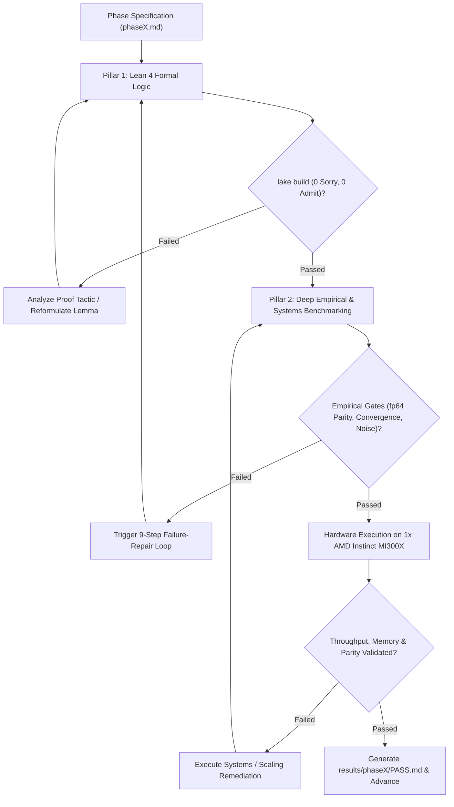

# Autonomous Agent Research Protocol: The Algebraic Stack

This directory contains the operational execution blueprints, formal verification specifications, empirical benchmarking protocols, and release standards for the **Algebraic Stack** research project.

The ultimate scientific question investigated across this repository is singular, foundational, and uncompromising:
$$\textbf{Can algebra and algebra alone give rise to intelligence?}$$

We mandate the strict **Zero-Transcendental Axiom**:
$$\text{No } e^x, \quad \text{No } \ln(x), \quad \text{No } \sin(x), \quad \text{No } \cos(x), \quad \text{No continuous exponential EMAs}, \quad \text{No cosine schedules.}$$
Every layer, activation, normalization, attention score, positional rotation, loss functional, divergence, and optimizer update must consist solely of rational operations, polynomial compositions, and a single hardware-native algebraic radical: $\operatorname{rsqrt}(x) = 1/\sqrt{x}$.

---

## 1. The Autonomous Constitution

All automated research execution in this repository is governed by:
$$\textbf{\href{AUTONOMY_PROTOCOL.md}{AUTONOMY\_PROTOCOL.md}}$$

Every numbered phase inherits all earlier gates and must strictly adhere to:
- **The Evidence Hierarchy:** Raw execution traces, checkpoints, and hardware measurements are authoritative over prose and expectations.
- **The 9-Step Failure-Repair Loop:** Freeze evidence $\to$ Classify failure $\to$ Research primary literature $\to$ Derive mathematical repair $\to$ Formalize in Lean 4 $\to$ Implement twice (fp64 CPU oracle vs. optimized path) $\to$ Test mechanism $\to$ Run all inherited gates $\to$ Iterate.
- **Gate Amendment Discipline:** Thresholds are never lowered for convenience or disappointing results; gates may only be versioned if evidence refutes the theoretical claim or invalidates the evaluation harness.
- **The Reproducibility Contract:** Deterministic seed pinning, fp64 oracle standard, synchronized GPU timing, and equal-budget baseline comparisons.
- **Formal Verification Contract:** Zero-axiom Lean 4 compilation via Mathlib4 with zero `sorry` and zero `admit`.
- **PASS Record:** Each phase officially concludes only upon generating `results/phaseN/PASS.md`.

---

## 2. Hardware Substrate: 1x AMD Instinct MI300X (ROCm / HIP)

All empirical simulation, kernel execution, and pretraining phases run on this machine's dedicated hardware accelerator:
- **Accelerator:** 1x AMD Instinct MI300X GPU (CDNA3 architecture, `gfx942`).
- **Memory Capacity:** **192 GB unified HBM3** with **5.3 TB/s** peak memory bandwidth.
- **Software Stack:** ROCm toolchain (`HIP 6.2+`, `hipcc` at `/opt/rocm/bin/hipcc`, AMD Clang, AMD Triton).
- **Substrate Advantage:**
  - With **192 GB of high-bandwidth memory on a single socket**, 125M and 350M models train locally without distributed pipeline stalls or multi-node communication bottlenecks.
  - Custom CDNA3 Wave64 kernels eliminate inter-tile log-sum-exp synchronization barriers.

---

## 3. The Ten Research & Verification Phases

The autonomous research lifecycle is organized into **exactly ten sequential phases** (`phase1.md` through `phase10.md`):

| Phase File | Phase Title | Primary Focus & Verification Milestone |
| :--- | :--- | :--- |
| [**`phase1.md`**](phase1.md) | **Pure Algebraic Primitives & Non-Linear Gating** | ALU inflection point at $x = -\sqrt{2}$, parameter-free AVN, Horner cubic backward, and 32-layer variance preservation. |
| [**`phase2.md`**](phase2.md) | **Octic Algebraic Attention & 2-Lipschitz Bounds** | A-Softmax 3-stage squaring ($\kappa_8$), uniform Jacobian bound $\le n/4 = 2.0$, dynamic contrast $> 10^5$, and $\ge 100\times$ FP4 quantization noise reduction. |
| [**`phase3.md`**](phase3.md) | **Algebraic Geometric Oscillators & Shift Equivariance** | AGO Cayley transform on $\mathfrak{so}(2)$, unimodular rotation ($\det=1$), relative shift equivariance, and $\mathcal{O}(1)$ autoregressive decode updates. |
| [**`phase4.md`**](phase4.md) | **Algebraic Loss Functionals & Information Metrics** | OACE $\mathcal{L}_{1/8}$ via 3 $\operatorname{rsqrt}$ calls, bounded gradient $8 p_k^{-1/8}$, Pearson $\chi^2$ divergence, and Fisher information equivalence $2 \nabla^2 D_{\text{KL}}$. |
| [**`phase5.md`**](phase5.md) | **Factorized Curvature Optimization & Rational Scheduling** | ACO $\mathcal{O}(d_{\text{out}} + d_{\text{in}})$ curvature preconditioning, $\ge 45\%$ optimizer memory reduction, and ARDS rational decay schedule $\operatorname{rsqrt}(1 + \alpha t^2)$. |
| [**`phase6.md`**](phase6.md) | **Hardware-Fused Kernels & Algebraic FlashAttention** | Fused CDNA3 Wave64 HIP C++ and AMD Triton kernels for AFA, sustaining $> 3.5\text{ TB/s}$ HBM3 bandwidth and pure additive tile accumulation. |
| [**`phase7.md`**](phase7.md) | **Full Architecture Assembly & Pilot Pretraining** | Complete `AlgebraicTransformerLM` assembly and $10^5$-step pilot pretraining (15M parameters on WikiText-103 on MI300X) vs. `StandardTransformerLM`. |
| [**`phase8.md`**](phase8.md) | **Frontier Pretraining: 125M Parameters on 1.0B Tokens** | Head-to-head pretraining across Seeds 42, 1337, and 2026 on 1B FineWeb-Edu tokens on 1x MI300X; statistical significance (mean $\pm$ SEM) across downstream reasoning probes. |
| [**`phase9.md`**](phase9.md) | **Scaled Pretraining: 350M Parameters on 3.0B Tokens & Scaling Laws** | Scaling to 24 layers, width 1024, and 3B tokens; neural scaling law power-law validation, deep variance stability, and Hierarchical Scaling Back-Propagation Loop. |
| [**`phase10.md`**](phase10.md) | **Comprehensive Research Paper, Clean-Room Replication, & Release** | Clean-room fresh-clone replication on MI300X, standalone paper finalization (`theory.md`), full completion matrix, and open-source publication package. |

---

## 4. Dual-Pillar Verification Paradigm



Every phase enforces the **Dual-Pillar Verification Contract**:
1. **Pillar 1: Machine-Checked Formal Verification:** Lean 4 modules in `formal/AlgebraicTheory/` compiled cleanly with Mathlib4 via `/root/.elan/bin/lake build`.
2. **Pillar 2: Rigorous Empirical & Hardware Testing:** High-sample Monte Carlo simulations, deep gradient flow tracking, sub-byte quantization noise stress, and full pretraining on 1x AMD Instinct MI300X.

---

## 5. Execution Commands

```bash
# Run primitive verification suite (Environment audit, AST check, fp64 tests):
python3 analysis/verify_algebraic_primitives.py

# Run comparative empirical benchmarks:
python3 analysis/benchmark_algebraic_vs_transcendental.py

# Compile formal Lean 4 proofs:
cd formal && /root/.elan/bin/lake build
```
