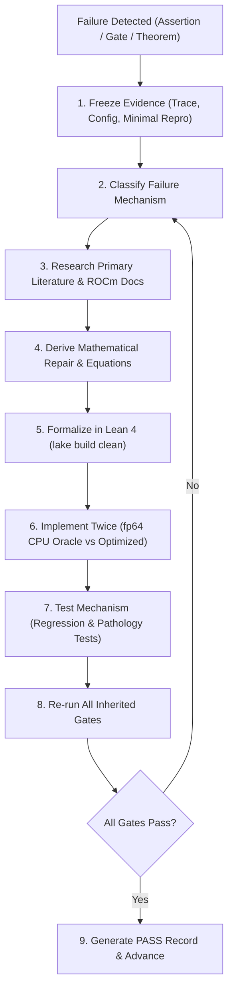

# Algebraic Intelligence Autonomous Phase Protocol & Roadmap

This document serves as the master autonomous constitution, operating protocol, and execution roadmap for the **Algebraic Stack** research project. Every numbered phase inherits all earlier gates and must strictly obey this protocol.

The ultimate scientific question investigated across this repository is singular, foundational, and uncompromising:
$$\textbf{Can algebra and algebra alone give rise to intelligence?}$$

We mandate the strict **Zero-Transcendental Axiom**:
$$\text{No } e^x, \quad \text{No } \ln(x), \quad \text{No } \sin(x), \quad \text{No } \cos(x), \quad \text{No continuous exponential EMAs}, \quad \text{No cosine schedules.}$$
Every forward pass, backward pass, activation function, normalization layer, attention mechanism, relative positional encoding, loss functional, divergence, and optimizer update must consist strictly of rational operations $(+, -, \cdot, /)$, polynomial compositions, and a single hardware-native algebraic radical:
$$\operatorname{rsqrt}(z) = \frac{1}{\sqrt{z}} \quad (z > 0).$$

---

## 1. Foundational Algebraic Primitives

The core architecture constructed, verified, and scaled across this repository is the **Algebraic Transformer** (`AlgebraicTransformerLM`), consisting of:
1. **Algebraic Linear Unit (ALU):** $K(x) = \frac{x}{2}(1 + u)$ with $u = x \cdot \operatorname{rsqrt}(x^2 + 1)$, closed-form Horner cubic backward $K'(x) = 0.5 + u(1.0 - 0.5 u^2)$, inflection point at $x = -\sqrt{2}$ matching GELU, and global Lipschitz bound $L_K \approx 1.04433$.
2. **Algebraic Variance Normalization (AVN):** Parameter-free projection $\hat{\mathbf{x}} = \mathbf{x} \cdot \operatorname{rsqrt}(m_2(\mathbf{x}) + \epsilon)$, eliminating learnable channel scales $\boldsymbol{\gamma}$ from HBM, strictly satisfying the Coupling Identity $\beta(x; v) = \beta(\hat{x}; 1)$.
3. **Algebraic Softmax (A-Softmax):** $\mathbf{S}_n(\mathbf{s})_i = \rho(\hat{s}_i)^n / (\sum_j \rho(\hat{s}_j)^n + \Omega)$ with kernel $\rho(x) = x + \sqrt{x^2 + 1}$, sharpening exponent $n = 8 = 2^3$ evaluated via 3 hardware squarings, globally 2-Lipschitz, uniform diagonal Jacobian bound $\le n/4 = 2.0$, routing contrast $> 10^5$, and rational attention sink $\Omega \ge 0$.
4. **Octo-Algebraic Cross-Entropy (OACE / $\mathcal{L}_{1/8}$):** Strictly proper scoring rule $\mathcal{L}_{1/8}(p_k) = 8(p_k^{-1/8} - 1)$ evaluated via 3 sequential $\operatorname{rsqrt}$ operations, with strictly bounded gradient $8 p_k^{-1/8}$, eliminating logarithmic singularities.
5. **Algebraic Divergence (AD):** Strictly proper Pearson $\chi^2$ divergence $D_A(\mathbf{y} \| \mathbf{p}) = \sum y_i^2 / p_i - 1$, Riemannian Fisher information metric equivalence $\nabla^2 D_A|_{\mathbf{p}=\mathbf{y}} = 2 \nabla^2 D_{\text{KL}}|_{\mathbf{p}=\mathbf{y}}$, and bounded gradients.
6. **Algebraic Geometric Ordering (AGO):** Static skew generator $\mathbf{A}_k = \omega_k \mathbf{J}$ on $\mathfrak{so}(2)$, rational Cayley transform $\mathbf{R}_k = (\mathbf{I} + \omega_k \mathbf{J})(\mathbf{I} - \omega_k \mathbf{J})^{-1}$, unimodular $\mathrm{SO}(2)$ rotation ($\det = 1$), exact relative shift equivariance $\langle \mathbf{Q}_m, \mathbf{K}_n \rangle = f(n - m)$, and $\mathcal{O}(1)$ autoregressive decode updates via 4 FMAs.
7. **Algebraic FlashAttention (AFA):** Strictly positive kernel $\rho^8$ enabling pure additive tile accumulation without running-max subtraction $\exp(m_{\text{old}} - m_{\text{new}})$, and single-pass lock-free asynchronous Ring Attention via a single global AllReduce.
8. **ALU-GLU:** Feed-forward network $\mathbf{W}_d [(\mathbf{W}_g \mathbf{x}) \odot K(\mathbf{W}_u \mathbf{x})]$ with polynomial backward graph in cached $u$ and universal approximation certificate.
9. **Algebraic Curvature Optimizer (ACO):** Factorized $\mathcal{O}(d_{\text{out}} + d_{\text{in}})$ curvature preconditioning $\hat{\mathbf{V}}_{ij} = \sqrt{\hat{r}_i \hat{c}_j}$, rational momentum, polynomial debiasing, and Algebraic Rational Decay Schedule (ARDS) $\eta_t \propto \operatorname{rsqrt}(1 + \alpha t^2)$.

---

## 2. Hardware Substrate: 1x AMD Instinct MI300X (ROCm / HIP)

All empirical simulation, kernel execution, and pretraining phases run on this machine's dedicated hardware accelerator:
- **Accelerator:** 1x AMD Instinct MI300X GPU (CDNA3 architecture, `gfx942`).
- **Memory Capacity:** **192 GB unified HBM3** with **5.3 TB/s** peak memory bandwidth.
- **Software Stack:** ROCm toolchain (`HIP 6.2+`, `hipcc` at `/opt/rocm/bin/hipcc`, AMD Clang, AMD Triton).
- **Substrate Advantage:**
  - With **192 GB of high-bandwidth memory on a single socket**, 125M and 350M models train locally without distributed pipeline stalls or multi-node communication bottlenecks.
  - Custom CDNA3 Wave64 kernels eliminate inter-tile log-sum-exp synchronization barriers.

---

## 3. The Ten Research & Verification Phases

The autonomous research lifecycle is organized into **exactly ten sequential phases** (`phase1.md` through `phase10.md`):

| Phase File | Phase Title | Primary Focus & Verification Milestone |
| :--- | :--- | :--- |
| [**`phase1.md`**](phase1.md) | **Pure Algebraic Primitives & Non-Linear Gating** | ALU inflection point at $x = -\sqrt{2}$, parameter-free AVN, Horner cubic backward, and 32-layer variance preservation. |
| [**`phase2.md`**](phase2.md) | **Octic Algebraic Attention & 2-Lipschitz Bounds** | A-Softmax 3-stage squaring ($\kappa_8$), uniform Jacobian bound $\le n/4 = 2.0$, dynamic contrast $> 10^5$, and $\ge 100\times$ FP4 quantization noise reduction. |
| [**`phase3.md`**](phase3.md) | **Algebraic Geometric Oscillators & Shift Equivariance** | AGO Cayley transform on $\mathfrak{so}(2)$, unimodular rotation ($\det=1$), relative shift equivariance, and $\mathcal{O}(1)$ autoregressive decode updates. |
| [**`phase4.md`**](phase4.md) | **Algebraic Loss Functionals & Information Metrics** | OACE $\mathcal{L}_{1/8}$ via 3 $\operatorname{rsqrt}$ calls, bounded gradient $8 p_k^{-1/8}$, Pearson $\chi^2$ divergence, and Fisher information equivalence $2 \nabla^2 D_{\text{KL}}$. |
| [**`phase5.md`**](phase5.md) | **Factorized Curvature Optimization & Rational Scheduling** | ACO $\mathcal{O}(d_{\text{out}} + d_{\text{in}})$ curvature preconditioning, $\ge 45\%$ optimizer memory reduction, and ARDS rational decay schedule $\operatorname{rsqrt}(1 + \alpha t^2)$. |
| [**`phase6.md`**](phase6.md) | **Hardware-Fused Kernels & Algebraic FlashAttention** | Fused CDNA3 Wave64 HIP C++ and AMD Triton kernels for AFA, sustaining $> 3.5\text{ TB/s}$ HBM3 bandwidth and pure additive tile accumulation. |
| [**`phase7.md`**](phase7.md) | **Full Architecture Assembly & Pilot Pretraining** | Complete `AlgebraicTransformerLM` assembly and $10^5$-step pilot pretraining (15M parameters on WikiText-103 on MI300X) vs. `StandardTransformerLM`. |
| [**`phase8.md`**](phase8.md) | **Frontier Pretraining: 125M Parameters on 1.0B Tokens** | Head-to-head pretraining across Seeds 42, 1337, and 2026 on 1B FineWeb-Edu tokens on 1x MI300X; statistical significance (mean $\pm$ SEM) across downstream reasoning probes. |
| [**`phase9.md`**](phase9.md) | **Scaled Pretraining: 350M Parameters on 3.0B Tokens & Scaling Laws** | Scaling to 24 layers, width 1024, and 3B tokens; neural scaling law power-law validation, deep variance stability, and Hierarchical Scaling Back-Propagation Loop. |
| [**`phase10.md`**](phase10.md) | **Comprehensive Research Paper, Clean-Room Replication, & Release** | Clean-room fresh-clone replication on MI300X, standalone paper finalization (`theory.md`), full completion matrix, and open-source publication package. |

---

## 4. Evidence Hierarchy

Use current files, raw execution logs, serialized tensors, checkpoints, and hardware-level measurements as authoritative evidence. Treat prose, theoretical expectations, and prior passing reports as hypotheses until reproduced.

1. **Primary Sources:** Cite mathematical papers, official AMD ROCm/HIP documentation, IEEE/SIAM numerical standards, and verified code implementations.
2. **Raw Output Primacy:** A terminal log or JSON metric artifact is authoritative over markdown claims. If prose says "perplexity ratio $\le 1.08$" but the raw log shows $1.42$, the phase is **FAILED**.
3. **No Cosmetic Relabeling:** Never relabel old transcendental runs as algebraic data. Stale experiments whose equations do not match the current algebraic formulation must be archived or deleted.
4. **Hardware Measurements:** All systems metrics (throughput, latency, memory bandwidth, VRAM footprint) must be measured with explicit GPU synchronization on the target AMD Instinct MI300X GPU (`gfx942`).

---

## 5. Mandatory Failure-Repair Loop

Whenever any assertion, Lean proof, numerical tolerance, training loss criterion, parity threshold, or inherited gate fails, the autonomous agent must execute this strict 9-step loop:



1. **Freeze the evidence.** Save the failing configuration, seed, execution command, environment fingerprint, raw traceback, metrics, and minimal reproducible test case.
2. **Classify the failure.** Select root cause: implementation bug, numerical conditioning, hardware/kernel, optimizer/data, representation pathology, model misspecification, theorem/assumption mismatch, evaluator error, or external resource.
3. **Research before patching.** Search primary mathematical literature, official AMD ROCm documentation, and numerical analysis texts. Blind hyperparameter tuning is strictly forbidden.
4. **Derive a repair.** Write down complete equations, invariants, predicted quantitative effect, valid operational domain, and a counterexample outside that domain.
5. **Formalize the repair.** Add or update a faithful Lean 4 statement in `formal/AlgebraicTheory/`. Run `/root/.elan/bin/lake build`.
6. **Implement twice where feasible.** First implement in an independent fp64 CPU reference path. Then implement in the production eager or kernel-accelerated path without shared helper shortcuts.
7. **Test the mechanism.** Add a targeted regression test that fails before the repair and passes after it. Include pathology stress tests.
8. **Run all inherited gates.** A repair that resolves the current phase but breaks any gate from an earlier phase is immediately rejected.
9. **Iterate.** Repeat from step 1 until every current and inherited phase gate passes cleanly.

---

## 6. Gate Amendment Discipline

A gate may change **only** when preserved empirical evidence proves that its underlying scientific claim is false or its evaluation harness is mathematically invalid.
- Never lower a threshold because a training run is slow, expensive, or disappointing.
- Never delete a test because it is difficult to pass.
- When an amendment is scientifically justified: version the gate, retain the historical failing evidence, update `theory.md`, and replace the gate with a stricter, more faithful test.
- If an external blocker halts progress, document it exhaustively and leave the phase in a failed state; **never manufacture a synthetic PASS**.

---

## 7. Reproducibility & Dual-Pillar Verification Contracts

1. **Deterministic Pinning:** Pin random seeds across Python, NumPy, and PyTorch. Pin dataset shard hashes, tokenizer versions, and model configurations.
2. **The fp64 Oracle Standard:** Double precision (`torch.float64`) on CPU is the authoritative numerical ground truth. Reduced precision is evaluated under condition-aware tolerances $\text{Tol}(\kappa) = C \cdot \epsilon_{\text{mach}} \cdot \kappa$.
3. **Equal-Budget Discipline:** Head-to-head comparisons against the Standard Causal Transformer maintain strict budget equivalence: parameters ($\pm 1\%$), training tokens, batch size, context length, and optimizer step counts.
4. **Lean 4 Formal Verification:** `/root/.elan/bin/lake build` must compile cleanly with zero errors, zero warnings, zero `sorry`, and zero `admit`.

---

## 8. Target Substrate Contract: AMD Instinct MI300X

1. **Hardware Specification:** Dedicated 1x AMD Instinct MI300X GPU (CDNA3 architecture, `gfx942`, 192 GB unified HBM3 memory, 5.3 TB/s memory bandwidth).
2. **ROCm/HIP Exclusivity:** Use ROCm toolchains (`HIP 6.2+`, `hipcc`, AMD Clang, AMD Triton). NVIDIA CUDA toolkits and proprietary CUDA libraries are strictly forbidden.
3. **CDNA3 Wave64 Exploitation:** Custom kernels (AFA) exploit CDNA3 Wave64 vector architecture (`warp_size = 64`), LDS, and VGPR allocation to eliminate serialization barriers.

---

## 9. PASS Record Contract

Each phase officially concludes only when `results/phaseN/PASS.md` is generated, containing:
1. Complete list of phase gates and exact relative paths to direct evidence;
2. Unabridged reproduction commands from a fresh shell;
3. Complete ledger of failed iterations, root-cause classifications, and applied repairs;
4. Theoretical adjustments to `theory.md`;
5. Lean 4 theorem additions and clean `lake build` logs;
6. High-resolution figures and tabular metrics (mean $\pm$ SEM, 95% CIs);
7. Git commit hash, working-tree dirty status, and hardware fingerprint;
8. Acknowledged limitations that remain open questions for future phases.

---

## 10. Execution Commands

```bash
# Run primitive verification suite (Environment audit, AST check, fp64 tests):
python3 analysis/verify_algebraic_primitives.py

# Run comparative empirical benchmarks:
python3 analysis/benchmark_algebraic_vs_transcendental.py

# Compile formal Lean 4 proofs:
cd formal && /root/.elan/bin/lake build
```
