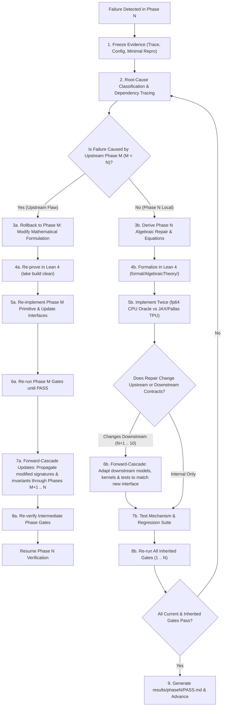

# Algebraic Intelligence Autonomous Phase Protocol & Roadmap

This document serves as the master autonomous constitution, operating protocol, and execution roadmap for the **Algebraic Stack** research project. Every numbered phase inherits all earlier gates and must strictly obey this protocol.

The ultimate scientific question investigated across this repository is singular, foundational, and uncompromising:
$$\textbf{Can algebra and algebra alone give rise to intelligence?}$$

We mandate the strict **Zero-Transcendental Axiom**:
$$\text{No } e^x, \quad \text{No } \ln(x), \quad \text{No } \sin(x), \quad \text{No } \cos(x), \quad \text{No continuous exponential EMAs}, \quad \text{No cosine schedules.}$$
Every forward pass, backward pass, activation function, normalization layer, attention mechanism, relative positional encoding, loss functional, divergence, and optimizer update must consist strictly of rational operations $(+, -, \cdot, /)$, polynomial compositions, and a single hardware-native algebraic radical:
$$\operatorname{rsqrt}(z) = \frac{1}{\sqrt{z}} \quad (z > 0).$$

---

## 1. Foundational Algebraic Primitives

The core architecture constructed, verified, and scaled across this repository is the **Algebraic Transformer** (`AlgebraicTransformerLM`), consisting of:
1. **Algebraic Linear Unit (ALU):** $K(x) = \frac{x}{2}(1 + u)$ with $u = x \cdot \operatorname{rsqrt}(x^2 + 1)$, closed-form Horner cubic backward $K'(x) = 0.5 + u(1.0 - 0.5 u^2)$, inflection point at $x = -\sqrt{2}$ matching GELU, and global Lipschitz bound $L_K \approx 1.04433$.
2. **Algebraic Variance Normalization (AVN):** Parameter-free projection $\hat{\mathbf{x}} = \mathbf{x} \cdot \operatorname{rsqrt}(m_2(\mathbf{x}) + \epsilon)$, eliminating learnable channel scales $\boldsymbol{\gamma}$ from high-bandwidth memory, strictly satisfying the Coupling Identity $\beta(x; v) = \beta(\hat{x}; 1)$.
3. **Algebraic Softmax (A-Softmax):** $\mathbf{S}_n(\mathbf{s})_i = \rho(\hat{s}_i)^n / (\sum_j \rho(\hat{s}_j)^n + \Omega)$ with kernel $\rho(x) = x + \sqrt{x^2 + 1}$, sharpening exponent $n = 8 = 2^3$ evaluated via 3 hardware squarings, globally 2-Lipschitz, uniform diagonal Jacobian bound $\le n/4 = 2.0$, routing contrast $> 10^5$, and rational attention sink $\Omega \ge 0$.
4. **Octo-Algebraic Cross-Entropy (OACE / $\mathcal{L}_{1/8}$):** Strictly proper scoring rule $\mathcal{L}_{1/8}(p_k) = 8(p_k^{-1/8} - 1)$ evaluated via 3 sequential $\operatorname{rsqrt}$ operations, with strictly bounded gradient $8 p_k^{-1/8}$, eliminating logarithmic singularities.
5. **Algebraic Divergence (AD):** Strictly proper Pearson $\chi^2$ divergence $D_A(\mathbf{y} \| \mathbf{p}) = \sum y_i^2 / p_i - 1$, Riemannian Fisher information metric equivalence $\nabla^2 D_A|_{\mathbf{p}=\mathbf{y}} = 2 \nabla^2 D_{\text{KL}}|_{\mathbf{p}=\mathbf{y}}$, and bounded gradients.
6. **Algebraic Geometric Ordering (AGO):** Static skew generator $\mathbf{A}_k = \omega_k \mathbf{J}$ on $\mathfrak{so}(2)$, rational Cayley transform $\mathbf{R}_k = (\mathbf{I} + \omega_k \mathbf{J})(\mathbf{I} - \omega_k \mathbf{J})^{-1}$, unimodular $\mathrm{SO}(2)$ rotation ($\det = 1$), exact relative shift equivariance $\langle \mathbf{Q}_m, \mathbf{K}_n \rangle = f(n - m)$, and $\mathcal{O}(1)$ autoregressive decode updates via 4 FMAs.
7. **Algebraic FlashAttention (AFA):** Strictly positive kernel $\rho^8$ enabling pure additive tile accumulation without running-max subtraction $\exp(m_{\text{old}} - m_{\text{new}})$, and single-pass lock-free asynchronous Ring Attention via a single global AllReduce over the Inter-Chip Interconnect (ICI).
8. **ALU-GLU:** Feed-forward network $\mathbf{W}_d [(\mathbf{W}_g \mathbf{x}) \odot K(\mathbf{W}_u \mathbf{x})]$ with polynomial backward graph in cached $u$ and universal approximation certificate.
9. **Algebraic Optimization (AdamW + ARDS):** The standard AdamW optimizer is natively algebraic, employing rational momentum $\mathbf{M}_t$, rational coordinate variance $\mathbf{V}_t$, exact polynomial debiasing $\delta(t) = 1 - \beta^t$ via integer powers, coordinate scaling via hardware $\operatorname{rsqrt}$, decoupled algebraic weight decay, and Algebraic Rational Decay Schedule (ARDS) $\eta_t \propto \operatorname{rsqrt}(1 + \alpha t^2)$—holding the optimizer strictly constant across both architectures to isolate pure architectural effects without transcendental functions ($e^x, \ln x, \cos x$).

---

## 2. Hardware Substrate: Google Cloud TPU v4 Pod Slice (16 TPU v4 Chips)

All empirical simulations, kernel executions, distributed scaling, and pretraining phases target a dedicated **Google Cloud TPU v4 Pod slice** consisting of **16 TPU v4 chips** (TPU v4-16):
- **Accelerator Topology:** 16 physical TPU v4 chips arranged in a $4 \times 2 \times 2$ 3D Torus mesh connected via dedicated optical circuit switches (OCS) and Inter-Chip Interconnect (ICI).
- **Core Architecture:** 32 TensorCore compute engines (2 TensorCores per TPU v4 chip). Each TensorCore houses two 128×128 Matrix Multiply Units (MXUs) specialized for bfloat16 systolic matrix multiplications, along with dedicated Vector Processing Units (VMUs) for elementwise arithmetic and hardware $\operatorname{rsqrt}$.
- **Compute Throughput:** ~275 TFLOPS (BF16) per chip $\implies \approx \mathbf{4.4\text{ PFLOPS}}$ aggregate peak BF16 compute across the 16-chip pod slice.
- **Memory Capacity & Bandwidth:** **32 GB HBM2e per chip** ($\mathbf{512\text{ GB}}$ aggregate unified HBM across the 16 chips) with ~1.2 TB/s per chip ($\approx \mathbf{19.2\text{ TB/s}}$ aggregate memory bandwidth).
- **Interconnect Bandwidth:** 4.8 Tbps bi-directional ICI bandwidth per chip, enabling ultra-low-latency distributed collective communications (AllReduce, AllGather, ReduceScatter) with zero host-CPU bottleneck.
- **Software & Compiler Stack:**
  - JAX and XLA compiler infrastructure (`jax`, `jax.numpy`, `flax.linen`, `optax`).
  - **JAX Pallas** (`jax.experimental.pallas`, `pallas.tpu`) for custom TPU v4 kernels executing directly within TensorCore Vector Memory (VMEM) and MXU systolic pipelines.
  - SPMD distributed parallelism via `jax.sharding.Mesh`, `NamedSharding`, and `jax.experimental.shard_map` across the 16 TPU v4 chips.

---

## 3. The Ten Research & Verification Phases

The autonomous research lifecycle is organized into **exactly ten sequential phases** (`phase1.md` through `phase10.md`):

| Phase File | Phase Title | Primary Focus & Verification Milestone |
| :--- | :--- | :--- |
| [**`phase1.md`**](phase1.md) | **Pure Algebraic Primitives & Non-Linear Gating** | ALU inflection point at $x = -\sqrt{2}$, parameter-free AVN, Horner cubic backward, and 32-layer variance preservation. |
| [**`phase2.md`**](phase2.md) | **Octic Algebraic Attention & 2-Lipschitz Bounds** | A-Softmax 3-stage squaring ($\kappa_8$), uniform Jacobian bound $\le n/4 = 2.0$, dynamic contrast $> 10^5$, and $\ge 100\times$ FP4/INT4 quantization noise reduction. |
| [**`phase3.md`**](phase3.md) | **Algebraic Geometric Oscillators & Shift Equivariance** | AGO Cayley transform on $\mathfrak{so}(2)$, unimodular rotation ($\det=1$), relative shift equivariance, and $\mathcal{O}(1)$ autoregressive decode updates. |
| [**`phase4.md`**](phase4.md) | **Algebraic Loss Functionals & Information Metrics** | OACE $\mathcal{L}_{1/8}$ via 3 $\operatorname{rsqrt}$ calls, bounded gradient $8 p_k^{-1/8}$, Pearson $\chi^2$ divergence, and Fisher information equivalence $2 \nabla^2 D_{\text{KL}}$. |
| [**`phase5.md`**](phase5.md) | **Algebraic Optimization & Rational Scheduling** | AdamW algebraic purity verification (zero $e^x, \ln x$), decoupled weight decay invariance, and ARDS rational decay schedule $\operatorname{rsqrt}(1 + \alpha t^2)$. |
| [**`phase6.md`**](phase6.md) | **Hardware-Fused Kernels & Algebraic FlashAttention (Pallas / XLA HLO)** | Fused JAX Pallas TPU kernels on TPU v4 VMU/MXU for AFA, sustaining $> 70\%$ peak HBM bandwidth and pure additive tile accumulation without running-max sync. |
| [**`phase7.md`**](phase7.md) | **Full Architecture Assembly & Pilot Pretraining** | Complete `AlgebraicTransformerLM` assembly and $10^5$-step pilot pretraining (15M parameters on WikiText-103 on 16 TPU v4 chips) vs. `StandardTransformerLM`. |
| [**`phase8.md`**](phase8.md) | **Systematic Hyperparameter Sweeping & Architecture Tuning** | Equal-budget 48-trial Pareto tuning study on 100M-token FineWeb-Edu slice on 16 TPU v4 Pod to discover optimal hyperparameters for both architectures. |
| [**`phase9.md`**](phase9.md) | **Frontier Pretraining: 125M Parameters on 2.5B Tokens** | Head-to-head pretraining across 6 runs (2 architectures $\times$ Seeds 42, 43, 44) on 2.5B FineWeb-Edu tokens across 16 TPU v4 chips; statistical significance (mean $\pm$ SEM). |
| [**`phase10.md`**](phase10.md) | **Comprehensive Research Paper, Clean-Room Replication, & Release** | Clean-room fresh-clone replication on 16 TPU v4 Pod slice, standalone paper finalization (`theory.md`), full completion matrix, and open-source publication package. |

---

## 4. Component-by-Component Baseline Benchmarking & Universal Parity Principle

Every algebraic primitive in this stack is designed as a direct algebraic drop-in replacement for a standard transcendental deep learning component. Across all phases, the evaluation protocol mandates direct, head-to-head benchmarking against the standard baseline.

### 4.1 Standard Baseline Mapping & Parity Thresholds

The defining acceptance gate for every algebraic primitive is the **Universal Parity Standard**:
> **Core Passing Gate Standard:** An algebraic component passes if it mathematically purges transcendental functions, guarantees numerical stability/boundedness, and performs **at par or within an acceptable minor tolerance ("a little down is acceptable")** relative to the standard transcendental component. The gains in numerical stability, hardware throughput, and memory savings offset minor metric differences.

| Phase | Algebraic Component | Standard Baseline Replaced | Comparative Benchmark Protocol | Acceptance Gate ("At Par or Minor Degradation Permitted") |
| :--- | :--- | :--- | :--- | :--- |
| **Phase 1** | **ALU** | GELU, Swish / SiLU | Direct forward/backward throughput & gradient flow vs. standard GELU | Throughput $\ge 90\%$ of GELU; gradient flow at par or within $\le 5\%$ variance delta. |
| **Phase 1** | **AVN** | RMSNorm, LayerNorm | Variance stabilization & memory overhead vs. standard RMSNorm | Throughput $\ge 95\%$ of RMSNorm; zero parameter footprint in HBM. |
| **Phase 2** | **A-Softmax** | Softmax | Attention score distribution & FP4 quantization noise vs. Softmax | Throughput $\ge 90\%$ of Softmax; attention distribution within $\le 5\%$ Wasserstein-1 delta; $\ge 100\times$ lower quantization noise in FP4. |
| **Phase 3** | **AGO** | RoPE ($\sin, \cos$) | Cayley rotary embedding throughput & associative recall vs. RoPE | Throughput $\ge 90\%$ of RoPE; associative recall retrieval at par or within $\le 3\%$ margin. |
| **Phase 4** | **OACE** | Cross-Entropy ($-\ln p$) | Optimization loss trajectory & label noise sensitivity vs. Cross-Entropy | Final convergence loss at par or within $\le 5\%$ of Cross-Entropy; $\le 50\%$ gradient variance under label noise. |
| **Phase 5** | **AdamW + ARDS** | AdamW + Cosine | Non-convex stochastic optimization (Rosenbrock & Rastrigin) with ARDS rational decay vs. Cosine Annealing | Final loss within $\le 2\%$ of Cosine Annealing; strictly zero transcendental function calls. |
| **Phase 6** | **AFA** | FlashAttention-2 | Fused Pallas TPU kernel throughput & tile streaming vs. FlashAttention-2 | Throughput $\ge 85\%$ of FlashAttention-2; sustained HBM bandwidth $\ge 70\%$ peak. |
| **Phase 7** | **Pilot (15M)** | Standard Transformer (15M) | $10^5$-step pretraining on WikiText-103 under identical token order | Validation perplexity within $\le 1.08\times$ ($\le 8\%$ degradation); throughput $\ge 90\%$. |
| **Phase 8** | **Sweep** | Standard Transformer | 48 equal-budget trials (24/arch) on 100M FineWeb-Edu tokens | Fair apples-to-apples hyperparameter discovery for both architectures. |
| **Phase 9** | **Full (125M)** | Standard Transformer (125M) | 2.5B FineWeb-Edu tokens across Seeds 42, 43, 44 | Validation perplexity within $\le 1.08\times$ ($\le 8\%$ degradation); downstream zero-shot reasoning within $2.0\%$ absolute margin. |

---

## 5. Evidence Hierarchy

Use current files, raw execution logs, serialized tensors, checkpoints, and hardware-level measurements as authoritative evidence. Treat prose, theoretical expectations, and prior passing reports as hypotheses until reproduced.

1. **Primary Sources:** Cite mathematical papers, official Google Cloud TPU v4 & JAX/Pallas documentation, IEEE/SIAM numerical standards, and verified code implementations.
2. **Raw Output Primacy:** A terminal log or JSON metric artifact is authoritative over markdown claims. If prose says "perplexity ratio $\le 1.08$" but the raw log shows $1.42$, the phase is **FAILED**.
3. **No Cosmetic Relabeling:** Never relabel old transcendental runs as algebraic data. Stale experiments whose equations do not match the current algebraic formulation must be archived or deleted.
4. **Hardware Measurements:** All systems metrics (throughput, latency, memory bandwidth, HBM footprint) must be measured with explicit TPU device synchronization (`jax.block_until_ready()`) on the target 16 TPU v4 Pod.

---

## 6. Mandatory Adaptive Failure-Repair & Bidirectional Dependency Cascading Protocol

Whenever any assertion, Lean proof, numerical tolerance, training loss criterion, parity threshold, or inherited gate fails, the autonomous agent must execute this **adaptive feedback loop**.

Crucially, **phases do not exist in isolation**: components in phase $N+1$ depend upon the contracts, tensor formats, normalization invariants, and kernel signatures established in phase $N$. Therefore, the agent must enforce **bidirectional dependency cascading**:



### 6.1 Step-by-Step Adaptive Execution Rules

1. **Freeze the evidence.** Save the failing configuration, seed, execution command, environment fingerprint, raw traceback, metrics, and minimal reproducible test case.
2. **Classify the failure & trace dependencies.** Determine if the failure is:
   - **Local to Phase $N$:** An implementation bug, precision tuning error, or kernel indexing issue within Phase $N$'s specific scope.
   - **Upstream Origin (Phase $M < N$):** A mathematical flaw, loose bound, or unstable invariant originating in an earlier phase (e.g., AFA kernel instability in Phase 6 caused by an un-bounded logit scale in Phase 2; pretraining divergence in Phase 7 caused by missing diagonal damping in Phase 5).
   - **Interface / Contract Evolution:** A change in Phase $N$ that alters input/output shapes, caching semantics, or normalization contracts.
3. **Upstream Rollback & Adaptation (if $M < N$):**
   - The agent MUST explicitly backtrack to Phase $M$.
   - Re-derive the foundational equations in Phase $M$.
   - Update Lean 4 proofs in `formal/AlgebraicTheory/` and verify `lake build` succeeds with zero errors.
   - Re-run Phase $M$ verification suite until PASS.
   - **Cascade forward:** Systematically adapt all intermediate phases $M+1, \dots, N$ to accommodate the updated primitive. Update their interfaces, regression tests, and documentation.
4. **Downstream Propagation (if Phase $N$ interface changes):**
   - If a repair in Phase $N$ modifies an interface (such as adding an attention sink parameter $\Omega$, altering Horner cubic cache layout $u$, modifying optimizer state layouts, or updating Pallas block tile sizes), the agent **MUST immediately update all downstream components** (Phases $N+1$ through $10$) that consume that interface.
   - Downstream models, test scripts, and benchmark configurations must be updated in lockstep before proceeding.
5. **Implement twice where feasible:**
   - First, implement in an independent `float64` CPU reference path (`numpy` / standard Python).
   - Second, implement in the production JAX / Pallas TPU accelerated path (`bfloat16` / `float32` on TPU v4).
6. **Test the mechanism:**
   - Add a targeted regression test that fails before the repair and passes after it.
   - Run boundary stress tests (extreme values, near-zero probabilities, long sequence lengths).
7. **Run all inherited gates:**
   - A repair that resolves the current phase but breaks any gate from an earlier phase is immediately rejected.
8. **Iterate:** Repeat until every current and inherited phase gate passes cleanly.

---

## 7. Target Codebase Architecture for 16 TPU v4 Pod

To cleanly isolate and execute the research lifecycle, all implementation files for the 16 TPU v4 Pod must be structured as follows:

```
algebraic-intelligence/
├── formal/                          # Lean 4 formal verification proofs
│   ├── AlgebraicTheory.lean
│   ├── AlgebraicTheory/             # Gate, Variance, Kernel, Cayley, Loss, Curvature
│   └── PROOF_COVERAGE.md
├── phases/                          # Autonomous phase instruction specifications (1-10)
│   ├── README.md
│   ├── phase1.md ... phase10.md
├── skills/                          # Autonomous research skills
├── src/                             # Core JAX / Pallas TPU codebase
│   ├── __init__.py
│   ├── primitives.py                # ALU, AVN, Horner cubic backward (@jax.custom_vjp)
│   ├── attention.py                 # Octic A-Softmax (κ₈), AGO Cayley rotary embeddings
│   ├── kernels/
│   │   ├── __init__.py
│   │   └── pallas_afa.py            # Custom JAX Pallas TPU kernel for AFA (VMEM/MXU)
│   ├── loss.py                      # OACE (L₁/₈) via 3 rsqrt, Pearson χ² divergence
│   ├── optimizer.py                 # Algebraic AdamW optimizer & ARDS schedule in Optax/JAX
│   ├── model.py                     # AlgebraicTransformerLM & StandardTransformerLM in Flax
│   └── mesh.py                      # 16 TPU v4 3D Torus mesh sharding (SPMD, shard_map)
├── tests/                           # Verification & regression test suites
│   ├── test_primitives.py           # Phase 1-5 verification tests (fp64 vs JAX, AST audit)
│   ├── test_kernel_parity.py        # Phase 6 Pallas TPU AFA vs exact reference
│   └── test_hparam_contracts.py     # Phase 8 hyperparameter contract verification
├── scripts/                         # Pretraining & benchmark scripts for 16 TPU v4 Pod
│   ├── run_verify_primitives.py     # Verification runner for Phase 1-5
│   ├── run_benchmark_pallas.py      # Benchmark runner for Phase 6 AFA on TPU v4
│   ├── audit_xla_hlo.py             # Static XLA HLO opcode and fusion inspector
│   ├── run_pilot_15m.py             # Phase 7: 15M LM pretraining on WikiText-103
│   ├── run_hparam_sweep.py          # Phase 8: Systematic 48-trial hyperparameter sweep
│   ├── run_pretrain_125m.py         # Phase 9: 125M LM on 2.5B FineWeb-Edu tokens (Seeds 42, 43, 44)
│   └── clean_room_reproduce.py      # Phase 10: One-command end-to-end audit
└── results/                         # Empirical records and PASS logs
    ├── phase1/PASS.md ... phase10/PASS.md
```

---

## 8. Gate Amendment Discipline

A gate may change **only** when preserved empirical evidence proves that its underlying scientific claim is false or its evaluation harness is mathematically invalid.
- Never lower a threshold because a training run is slow, expensive, or disappointing.
- Never delete a test because it is difficult to pass.
- When an amendment is scientifically justified: version the gate, retain the historical failing evidence, update `theory.md`, and replace the gate with a stricter, more faithful test.
- If an external blocker halts progress, document it exhaustively and leave the phase in a failed state; **never manufacture a synthetic PASS**.

---

## 9. Reproducibility & Dual-Pillar Verification Contracts

1. **Deterministic Pinning:** Pin random seeds across Python, NumPy, and JAX (`jax.random.PRNGKey`). Pin dataset shard hashes, tokenizer versions, and model configurations.
2. **The fp64 Oracle Standard:** Double precision (`numpy.float64` / `jax.numpy.float64`) on CPU is the authoritative numerical ground truth. Reduced precision is evaluated under condition-aware tolerances $\text{Tol}(\kappa) = C \cdot \epsilon_{\text{mach}} \cdot \kappa$.
3. **Equal-Budget Discipline:** Head-to-head comparisons against the Standard Causal Transformer maintain strict budget equivalence: parameters ($\pm 1\%$), training tokens, batch size, context length, and optimizer step counts.
4. **Lean 4 Formal Verification:** `/root/.elan/bin/lake build` must compile cleanly with zero errors, zero warnings, zero `sorry`, and zero `admit`.

---

## 10. Target Substrate Contract: 16 TPU v4 Pod Slice

1. **Hardware Specification:** Dedicated Google Cloud TPU v4 Pod slice with 16 TPU v4 chips (32 TensorCores, 512 GB unified aggregate HBM2e, 19.2 TB/s aggregate memory bandwidth, 4.8 Tbps bi-directional optical ICI interconnect).
2. **JAX / Pallas Exclusivity:** All hardware-fused kernels and distributed models must be implemented using JAX and JAX Pallas (`pallas.tpu`). Non-portable GPU-specific or vendor-locked proprietary libraries are strictly forbidden.
3. **VMEM & MXU Systolic Pipelining:** Custom Pallas AFA kernels exploit TPU v4 Vector Memory (VMEM) sub-blocking (e.g. $128 \times 128$ tiles) to stream directly into the 128×128 systolic MXUs without register spilling.
4. **Distributed Mesh Topology:** Sharding must explicitly map across the 16 TPU v4 chips using `jax.sharding.Mesh` with axes `('data', 'fsdp', 'model')` over the physical ICI 3D torus topology.

---

## 11. PASS Record Contract

Each phase officially concludes only when `results/phaseN/PASS.md` is generated, containing:
1. Complete list of phase gates and exact relative paths to direct evidence;
2. Unabridged reproduction commands from a fresh shell;
3. Complete ledger of failed iterations, root-cause classifications, dependency cascade records, and applied repairs;
4. Theoretical adjustments to `theory.md`;
5. Lean 4 theorem additions and clean `lake build` logs;
6. High-resolution figures and tabular metrics (mean $\pm$ SEM, 95% CIs);
7. Git commit hash, working-tree dirty status, and TPU cluster fingerprint;
8. Acknowledged limitations that remain open questions for future phases.

---

## 12. Master Execution Commands

```bash
# 1. Compile formal Lean 4 proofs:
cd formal && /root/.elan/bin/lake build

# 2. Run primitive verification suite (AST check, fp64 CPU oracle, JAX tests):
python3 scripts/run_verify_primitives.py

# 3. Run Pallas AFA hardware kernel benchmark on 16 TPU v4 Pod:
python3 scripts/run_benchmark_pallas.py

# 4. Launch distributed pilot pretraining (15M LM on 16 TPU v4 chips):
python3 scripts/run_pilot_15m.py
```
