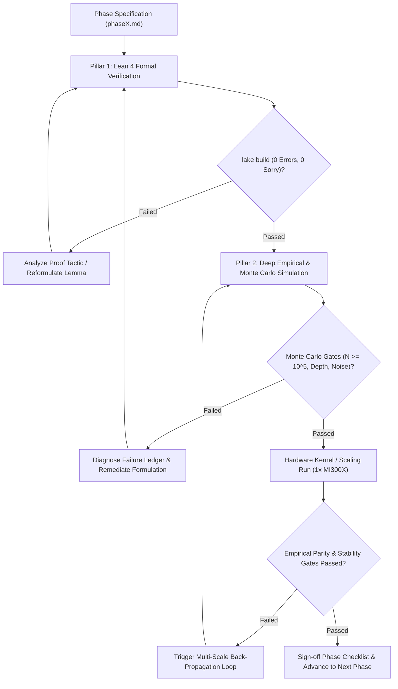

# Autonomous Agent Protocol: The Algebraic Stack

This directory contains the operational execution blueprints, formal verification specifications, and empirical Monte Carlo protocols for the **Algebraic Stack** research project.

The ultimate scientific question is singular, foundational, and uncompromising:
286390\textbf{Can algebra and algebra alone give rise to intelligence?}286390

We mandate the **Zero-Transcendental Axiom**:
286390\text{No } e^x, \quad \text{No } \ln(x), \quad \text{No } \sin(x), \quad \text{No } \cos(x), \quad \text{No continuous exponential EMAs}, \quad \text{No cosine schedules.}286390
Every layer, activation, attention score, positional rotation, loss divergence, and optimizer update must consist solely of rational operations, polynomial compositions, and a single hardware-native algebraic radical: $\operatorname{rsqrt}(x) = 1/\sqrt{x}$.

---

## 1. Target Hardware Environment: 1x AMD Instinct MI300X (ROCm / HIP)

All empirical and kernel phases execute on this machine's dedicated high-performance accelerator:
- **Accelerator:** 1x AMD Instinct MI300X GPU (CDNA3 architecture, `gfx942`).
- **Memory Capacity:** **192 GB HBM3** with **5.3 TB/s** peak memory bandwidth.
- **Compute Stack:** ROCm / HIP toolchain (`HIP 7.15+`, `hipcc` at `/opt/rocm/bin/hipcc`, AMD Clang).
- **Kernel Backends:** AMD Triton (`triton-amdgpu`) and native HIP C++ PyTorch extensions.
- **Hardware Architecture Advantage:**
  - With **192 GB of unified HBM3 memory on a single socket**, 10M–15M pilot models, 125M frontier models, and 350M scaled models fit entirely in local VRAM alongside full factorized optimizer state and activation caches with zero distributed pipeline stalls.
  - Custom CDNA3 Wave64 kernels eliminate inter-tile synchronization and log-sum-exp scaling barriers.

---

## 2. The Dual-Pillar Autonomous Research Paradigm

To avoid the twin traps of *unverified theory* (pure proofs that fail in numerical reality) and *superficial unit testing* (toy scripts that test formulas without stress), every phase enforces a **Dual-Pillar Verification Contract**:

### Pillar 1: Machine-Checked Formal Verification (Lean 4 + Mathlib4)
Mathematical claims must be codified in formal logic and compiled with **zero `sorry`**, zero axioms, and zero compilation errors. Formal proofs establish:
- Invariant preservation (unimodularity, partition of unity, reflection symmetry).
- Exact analytic derivations (polynomial backward passes, inflection point coordinates).
- Global operator bounds (Lipschitz continuity, variance coupling, norm preservation).

### Pillar 2: Deep Empirical & Monte Carlo Stress Testing
Code verification is not model validation. Every mathematical primitive must survive rigorous numerical contact:
- **High-Sample Monte Carlo Simulations ( = 10^5 - 10^6$ trials):** Testing behavior across wide probability regimes, input variance spreads, and parameter spectra.
- **Deep Gradient Flow & Depth Scaling (8 to 32 layers):** Measuring empirical Lyapunov exponents, vanishing/exploding gradient frequencies, and activation variance propagation.
- **Finite-Precision & Quantization Noise:** Evaluating robustness under stochastic perturbations and sub-byte FP4/INT4 simulated rounding.
- **Controlled Baseline Comparisons:** Every empirical metric must be directly contrasted against the matching standard transcendental baseline (GELU, Softmax, RoPE, Cross-Entropy, AdamW).
- **Statistical Rigor:** All empirical comparisons must report mean $\pm$ standard error of the mean (SEM) and 95% confidence intervals.

---

## 3. Master Phase Overview (10 Sequential Phases)

1. [**`phase1.md`**](phase1.md): **Pure Algebraic Primitives & Non-Linear Gating (ALU & AVN)**  
   Lean 4 proofs + 0^6$ Monte Carlo depth propagation trials (8–32 layers) verifying $\mathcal{O}(1)$ Horner backward caching, inflection dynamics, and variance preservation.
2. [**`phase2.md`**](phase2.md): **Octic Algebraic Attention & 2-Lipschitz Bounds (A-Softmax)**  
   Lean 4 proofs + 0^5$ Monte Carlo attention sweeps across context lengths  \in [64, 2048]$ under logit noise, verifying global 2-Lipschitz bounds, entropy stability, and FP4 robustness.
3. [**`phase3.md`**](phase3.md): **Algebraic Geometric Oscillators & Shift Equivariance (AGO)**  
   Lean 4 proofs + Long-context Monte Carlo extrapolation (=512 \to 8192$) certifying $\mathrm{SO}(2)$ group structure, rotation norm conservation, and out-of-distribution associative recall vs. RoPE.
4. [**`phase4.md`**](phase4.md): **Algebraic Loss Functionals & Information Metrics (OACE / $\mathcal{L}_{1/8}$)**  
   Lean 4 proofs + 0^5$ Monte Carlo trials under label noise and simplex boundary extremes ( \in [10^{-7}, 1 - 10^{-7}]$), verifying Fisher information equivalence and gradient boundedness.
5. [**`phase5.md`**](phase5.md): **Factorized Curvature Optimization & Rational Scheduling (ACO & ARDS)**  
   Lean 4 proofs + High-dimensional Monte Carlo stochastic optimization on ill-conditioned non-convex landscapes ($\kappa = 10^5$), proving $\mathcal{O}(d_{\text{out}} + d_{\text{in}})$ memory and $\mathcal{O}(1/\sqrt{T})$ convergence.
6. [**`phase6.md`**](phase6.md): **Hardware-Fused Kernel Implementation & Algebraic FlashAttention (AFA on MI300X)**  
   Native CDNA3 Wave64 HIP C++ and AMD Triton kernels for AFA, benchmarked against ROCm FlashAttention on the MI300X for sustained HBM3 bandwidth ($> 3.5\text{ TB/s}$) and lock-free additive accumulation.
7. [**`phase7.md`**](phase7.md): **Architectural Integration & Pilot Pretraining (10M–15M LM on MI300X)**  
   Full assembly into `AlgebraicTransformerLM`. Pilot pretraining on **WikiText-103** across 0^5$ steps on the MI300X, validating loss stability, throughput, and perplexity parity ($\le 1.08\times$).
8. [**`phase8.md`**](phase8.md): **Frontier Pretraining: 125M Parameters on 1B Tokens (3 Seeds on 1x MI300X)**  
   Head-to-head empirical pretraining across Seeds 42, 1337, and 2026 on FineWeb-Edu. Statistical significance (mean $\pm$ SEM) across perplexity and downstream benchmarks (ARC, HellaSwag, PIQA, LAMBADA).
9. [**`phase9.md`**](phase9.md): **Scaled Frontier Pretraining: 350M Parameters on 3B Tokens (3 Seeds on 1x MI300X)**  
   Scaling to 24 layers, width 1024, and 3B tokens. Empirical validation of neural scaling laws and execution of the Hierarchical Scaling Back-Propagation Loop with mandatory 125M regression checks.
10. [**`phase10.md`**](phase10.md): **Comprehensive Research Paper & Publication Release**  
    Synthesis of all formal certificates, empirical logs, scaling figures, and checkpoints into a publication-ready LaTeX paper and open-weights repository.

---

## 4. Hierarchical Multi-Scale Self-Correction Protocol

When scaling empirical runs, the autonomous engine operates a strict closed-loop self-correction policy:
- **Early Phase Discrepancy:** If Monte Carlo bounds fail in Phases 1–5, the agent cannot proceed to kernel or training phases. It must diagnose the mathematical root cause, update the formulation, re-prove the theorem in Lean 4, and re-execute the Monte Carlo sweep.
- **Pilot Phase Discrepancy (Phase 7):** If 10M–15M pretraining diverges or exceeds .08\times$ baseline perplexity, calibrate the attention sink $\Omega$ and rational decay parameter $\alpha$ before touching large-scale tokens.
- **Frontier Phase Discrepancy (Phase 8 & 9):** If 125M fails, halt. If 125M succeeds but 350M fails, trigger the **Hierarchical Scaling Back-Propagation Loop** (isolating depth, width, or horizon pathologies), apply the algebraic fix, run mandatory 125M regression testing, and only advance when both scales pass simultaneously.
