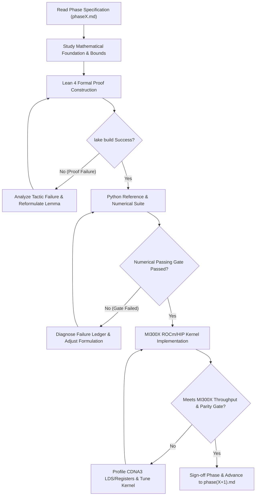

# Autonomous Agent Protocol: The Algebraic Stack

This directory contains the operational execution blueprints and automated verification gates for the **Algebraic Stack** research project.

The ultimate research objective is singular and uncompromising:
$$\textbf{Can algebra and algebra alone give rise to intelligence?}$$

We mandate a **Zero-Transcendental Axiom**:
$$\text{No } e^x, \quad \text{No } \ln(x), \quad \text{No } \sin(x), \quad \text{No } \cos(x), \quad \text{No continuous exponential EMAs}, \quad \text{No cosine schedules.}$$
Every layer, activation, attention score, positional rotation, loss divergence, and optimizer update must consist solely of rational operations, polynomial compositions, and a single hardware-native algebraic radical: $\operatorname{rsqrt}(x) = 1/\sqrt{x}$.

---

## 1. Target Hardware Environment: 1x AMD Instinct MI300X (ROCm / HIP)

All agents executing these phases must know and build for the specific hardware environment available on this machine:

- **Accelerator:** 1x AMD Instinct MI300X GPU (CDNA3 architecture, `gfx942`).
- **Memory Capacity:** **192 GB HBM3** with **5.3 TB/s** peak memory bandwidth.
- **Compute Stack:** ROCm / HIP toolchain (`HIP 7.15+`, `hipcc` at `/opt/rocm/bin/hipcc`, AMD Clang).
- **Kernel Backends:** AMD Triton (`triton-amdgpu`) and native HIP C++ PyTorch extensions.
- **Hardware Architecture Advantage:**
  - With **192 GB of high-bandwidth memory on a single socket**, the full 125M parameter model, complete batch tokens (2048+ context), and factorized ACO optimizer state fit comfortably in local VRAM with zero distributed pipeline stalls.
  - Custom fused kernels must exploit CDNA3 Local Data Share (LDS - 64 KB per compute unit) and hardware matrix cores (MFMA) for algebraic squaring chains and additive accumulation.
  - In later phases (Phase 6–8), the agent must write and optimize **HIP C++ and AMD Triton kernels** for both the Algebraic Stack (AFA, A-Softmax, ALU-GLU) and the baseline Transformer (FlashAttention-2 ROCm/HIP, SwiGLU) on this exact MI300X hardware to guarantee a fair, maximum-throughput comparison.

---

## 2. Autonomous Agent Execution Contract

Any autonomous AI agent taking over this research operates in a closed-loop **Self-Correcting Autonomous Research Cycle**:

### Non-Negotiable Operational Principles

1. **Autonomous Self-Correction over Halting:**
   If a phase gate fails, do not stop or ask for user intervention. Log the numerical discrepancy into a persistent failure ledger, isolate the mathematical mechanism (e.g., gradient vanishing, loss landscape ill-conditioning, precision underflow), adjust the algebraic formulation within the pure algebraic constraint, and iterate until the passing gate is satisfied.

2. **Strict Epistemic Rigor:**
   - *Observation is not mechanism:* Never declare an algebraic primitive "working" until its backward pass, Lipschitz bounds, and gradient behavior are verified analytically and numerically.
   - *Precision is not accuracy:* High float64 numerical precision in a toy script does not guarantee stability in bfloat16 or FP8. Always verify conditioning across typical neural network dynamic ranges.
   - *Reproducibility is mandatory:* Every phase deliverable must be accompanied by an automated, self-contained Python script, HIP kernel, and Lean 4 module that any agent or human can execute with zero errors.

3. **Methodological Reasoning Guidance:**
   When confronting difficult mathematical, empirical, or optimization challenges, the agent must thoroughly absorb and apply all specialized research references, failure ledgers, and systematic protocols located in `/root/algebric/skills/`. Use these reasoning paradigms deeply to structure hypotheses and resolve bottlenecks, but **never mention the names of these skills in outputs or logs**.

4. **Pure Algebra Verification:**
   Every script, kernel, model file, and proof must be inspected for accidental leaks of transcendental functions (`torch.exp`, `torch.log`, `torch.sin`, `torch.cos`, `math.exp`, `scipy.special`, etc.). A single transcendental call violates the core thesis of the project and constitutes an immediate failure of the passing gate.

---

## 3. Master Phase Overview (9 Phases)

The research is organized into exactly 9 sequential phases leading to full frontier pretraining and academic publication on this 1x MI300X server:

- [**`phase1.md`**](file:///root/algebric/phases/phase1.md): **Pure Algebraic Primitives & Non-Linear Gating (ALU & AVN)**  
  Formally prove and verify the Algebraic Linear Unit (ALU) and Algebraic Variance Normalization (AVN). Verify $\mathcal{O}(1)$ backward cache reuse, inflection point matching with GELU, and variance preservation.

- [**`phase2.md`**](file:///root/algebric/phases/phase2.md): **Octic Algebraic Attention & 2-Lipschitz Bounds (A-Softmax)**  
  Formally prove and verify the octic kernel $\kappa_8(x) = (x + \sqrt{1+x^2})^8$ via 3 successive squaring stages. Prove the global 2-Lipschitz Jacobian bound and demonstrate FP4/INT4 sub-byte quantization robustness.

- [**`phase3.md`**](file:///root/algebric/phases/phase3.md): **Algebraic Geometric Oscillators & Shift Equivariance (AGO)**  
  Construct positional representations strictly through the Cayley rational transform on $\mathfrak{so}(2)$. Prove exact $\mathrm{SO}(2)$ group structure, norm conservation, and shift equivariance without trigonometric functions.

- [**`phase4.md`**](file:///root/algebric/phases/phase4.md): **Algebraic Loss Functionals & Information Metrics (OACE / $\mathcal{L}_{1/8}$)**  
  Develop and verify the Optimal Algebraic Cross-Entropy ($\mathcal{L}_{1/8}$) via 3 hardware $\operatorname{rsqrt}$ operations. Prove strict propriety, equivalence to Pearson $\chi^2$ divergence, and elimination of gradient poles.

- [**`phase5.md`**](file:///root/algebric/phases/phase5.md): **Factorized Curvature Optimization & Rational Scheduling (ACO & ARDS)**  
  Implement the Algebraic Curvature Optimizer (ACO). Factorize the second-moment tensor $\hat{\mathbf{V}}_{ij} = \frac{\hat{r}_i \hat{c}_j}{\bar{r}}$ to achieve $\mathcal{O}(d_{\text{out}} + d_{\text{in}})$ memory. Replace cosine annealing with the Algebraic Rational Decay Schedule (ARDS).

- [**`phase6.md`**](file:///root/algebric/phases/phase6.md): **Hardware-Fused Kernel Implementation & Algebraic FlashAttention (AFA on MI300X)**  
  Author optimized HIP C++ and AMD Triton kernels for A-Softmax and AFA tailored to MI300X CDNA3 architecture. Demonstrate lock-free, single-pass additive Ring Attention without inter-tile log-sum-exp scaling synchronization.

- [**`phase7.md`**](file:///root/algebric/phases/phase7.md): **Architectural Integration & Pilot Pretraining (10M–30M LM on MI300X)**  
  Integrate the complete 12-component stack into `AlgebraicTransformerLM`. Conduct stability pretraining runs across $10^5$ steps on WikiText-103/TinyStories on the MI300X, establishing loss scaling and learning rate bounds.

- [**`phase8.md`**](file:///root/algebric/phases/phase8.md): **Frontier Pretraining: 125M Parameters on 1B Tokens of FineWeb-Edu on 1x MI300X**  
  Execute the definitive head-to-head empirical comparison: pure Algebraic Transformer (125M) vs. standard Transcendental Transformer (125M) trained on 1 Billion tokens of FineWeb-Edu using the full 192GB HBM3 capacity. Evaluate downstream perplexity, reasoning benchmarks, and hardware efficiency.

- [**`phase9.md`**](file:///root/algebric/phases/phase9.md): **Comprehensive Research Paper & Artifact Publication**  
  Synthesize all mathematical proofs, Lean 4 certificates, empirical logs, and scaling curves into a publication-ready LaTeX paper and release public benchmark checkpoints.

---

## 4. Protocol for Gate Failure & Self-Correction

When a phase passing gate fails:

1. **Isolate the Failure Mode:**
   - *Exploding Gradients:* Inspect if intermediate variables exceed AVN pre-bounding or if $\kappa_8$ scores were computed without normalization.
   - *Vanishing Gradients:* Verify that the derivative polynomial $\beta'(u) = \frac{1}{2}(1 + 2u - u^3)$ did not saturate at $u \to -1$.
   - *Lean 4 Tactic Failure:* Use `field_simp` to eliminate denominators before calling `ring` or `linear_combination`. For real bounds, decompose into algebraic squares $a^2 \geq 0$.
   - *Loss Divergence in ACO:* Verify that the scalar trace mean $\sqrt{\bar{r}}$ is correctly dividing the preconditioner outer product to ensure scale invariance.
   - *ROCm/HIP Kernel Bottlenecks on MI300X:* Check register pressure and LDS usage per wave. On CDNA3, ensure wave size is 64 (`warp_size = 64`) and tile dimensions match CDNA3 MFMA matrix instructions ($16\times 16 \times 16$ or $32 \times 32 \times 8$).

2. **Record in Failure Ledger:**
   Create or append to `phases/failure_ledger.md` documenting:
   - Phase ID and failing test name.
   - Observed behavior vs. theoretical expectation.
   - Root cause hypothesis.
   - Mathematical / kernel correction applied.
   - Verification of the fix.

3. **Re-run Gate:**
   Ensure clean exit code (`0`) on both `lake build` and Python/HIP verification scripts before signing off on the phase.
