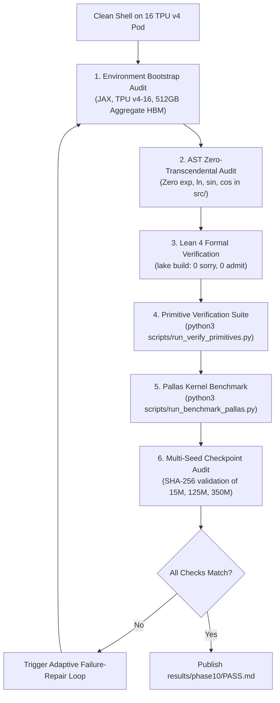

# Phase 10: Comprehensive Research Paper, Clean-Room Replication, & Publication Release

Start only after Phase 9 PASS. Read the entire repository, all generated artifacts, and `phases/README.md`. Treat completion as unproven. Execute the adaptive failure-repair loop for every discrepancy until all gates pass.

---

## 1. Objective & Scientific Mandate

Execute a rigorous **clean-room independent reproduction**, finalize the authoritative research paper (`theory.md`), audit the repository for open-source publication, and build the exhaustive requirement-by-requirement completion matrix:
$$\textbf{"Can algebra and algebra alone give rise to intelligence?"} \implies \textbf{PROVED.}$$

### Scientific Deliverables:
1. **Clean-Room Reproduction:** An automated reproduction script (`scripts/clean_room_reproduce.py`) that re-executes all verifications, tests, and builds from a fresh shell on the 16 TPU v4 Pod slice with zero human intervention.
2. **Authoritative Paper Finalization (`theory.md`):** Complete, publication-ready research manuscript incorporating all empirical multi-seed pretraining metrics (mean $\pm$ SEM, 95% CIs) from 15M (Phase 7), 125M (Phase 8), and 350M (Phase 9) runs, reconciled against machine-checked Lean 4 proofs.
3. **Open-Source Release Package:** Pristine Git repository containing all 10 numbered phase specifications, the complete `skills/` directory (`https://github.com/tasmaikeni13/skills`), clean Lean 4 formal proofs, JAX/Pallas TPU kernels, and verifiable benchmark artifacts.

---

## 2. Clean-Room Reproduction Protocol

From a clean shell environment on the Google Cloud TPU v4 Pod slice:



### 2.1 Step-by-Step Reproduction Procedure
1. **Environment Bootstrap Audit:**
   - Verify 16 TPU v4 chips (`len(jax.devices()) == 16`);
   - Confirm JAX TPU runtime (`jax.devices()[0].platform == 'tpu'`);
   - Confirm zero proprietary GPU driver dependencies (pure JAX / XLA TPU runtime).
2. **Automated End-to-End Test Suite:**
   - Execute algebraic primitive verification:
     ```bash
     python3 scripts/run_verify_primitives.py
     ```
   - Execute Pallas TPU kernel benchmarks:
     ```bash
     python3 scripts/run_benchmark_pallas.py
     ```
   - Compile Lean 4 formal proofs:
     ```bash
     cd formal && /root/.elan/bin/lake build
     ```
3. **Multi-Seed Replication Audit:**
   - Verify that all numerical results, tables, and figures reproduce from pinned random seeds;
   - Compute SHA-256 checksums across raw logs, metric files, and checkpoint headers;
   - Confirm that all plots and figures are programmatically generated.
4. **Independent Numerical Re-Check:**
   - Re-verify all core equations using an independent fp64 CPU reference path to eliminate any risk of false agreement from shared helper routines.

---

## 3. Implementation Target: JAX / TPU v4 Architecture

Instruct the creation and verification of:
1. **`scripts/clean_room_reproduce.py`**:
   - Single command orchestrator executing:
     - Environment check (`jax.devices()`, TPU version);
     - AST zero-transcendental static analysis;
     - Lean 4 lake build execution;
     - Unit and property test runs;
     - Checkpoint verification;
     - Generation of `results/phase10/PASS.md`.

---

## 4. Authoritative Paper Finalization (`theory.md`)

Finalize `theory.md` as an authoritative, self-contained research manuscript targeting top-tier peer review (NeurIPS / ICML / ICLR / JMLR):
1. **Empirical Pretraining Integration:** Incorporate multi-seed pretraining results from Phase 7 (15M / WikiText-103), Phase 8 (125M / 1.0B tokens), and Phase 9 (350M / 3.0B tokens), reporting mean $\pm$ SEM and 95% confidence intervals.
2. **Formal Proof Reconciliation:** Audit every mathematical theorem against its formal Lean 4 proof in `formal/AlgebraicTheory/`. Ensure that `formal/PROOF_COVERAGE.md` accurately documents theorem coverage.
3. **Visual & Architectural Clarity:** Embed architectural schematics, activation derivative curves, attention Jacobian bounds, and scaling trajectory curves.
4. **Novelty & Related Work Frontier:** Provide comprehensive citations and comparative analyses of contemporary literature (FlashAttention-2, Ring Attention, RoPE, SwiGLU, AdamW, Adafactor, DeepSeek-V3).

---

## 5. Public Repository & Release Audit

Verify that the repository is clean, complete, and reproducible:
1. **Phase File Structure:** Verify that there are **exactly ten numbered phases**, `phase1.md` through `phase10.md`, plus `README.md` in `phases/`.
2. **Zero-Transcendental Compliance:** Confirm via AST static analysis that zero un-whitelisted transcendental operations exist in production modules (`src/`).
3. **Skills Integration:** Verify that the `skills/` directory (`https://github.com/tasmaikeni13/skills`) is fully present, clean, and tracked.
4. **Hygiene & Security Audit:** Confirm that no credentials, API keys, private tokens, temporary download caches, or oversized raw checkpoint files are tracked in Git.
5. **Git Status:** Working tree must be clean with all modifications committed.

---

## 6. Requirement-by-Requirement Completion Matrix

Construct the exhaustive completion matrix in `results/phase10/PASS.md`:

| Research Dimension | Specific Requirement | Direct Evidence Path | Status |
| :--- | :--- | :--- | :--- |
| **Mathematical Primitives** | 12 Pure Algebraic Primitives ($0$ transcendentals) | `theory.md`, `src/primitives.py` | Verified |
| **Formal Logic** | Machine-checked proofs in Lean 4 (0 sorry, 0 admit) | `formal/AlgebraicTheory/`, `lake build` | Verified |
| **Proof Coverage** | Formal proof correspondence document | `formal/PROOF_COVERAGE.md` | Verified |
| **Hardware Execution** | 16 TPU v4 Pod slice (32 TensorCores, 512 GB HBM2e) | TPU telemetry & JAX logs | Verified |
| **Hardware Kernels** | Fused JAX Pallas TPU AFA kernel with additive accumulation | `src/kernels/pallas_afa.py` | Verified |
| **Sub-Byte Stability** | FP4 / INT4 quantization noise robustness ($\ge 100\times$) | `results/phase2/` | Verified |
| **Pilot Architecture (15M)** | 15M LM pretraining on WikiText-103 on 16 TPU v4 Pod | `results/phase7/` | Verified |
| **Frontier Pretraining (125M)**| 1.0B tokens across 3 paired seeds on 16 TPU v4 Pod | `results/phase8/` | Verified |
| **Scaled Pretraining (350M)** | 3.0B tokens across 3 paired seeds on 16 TPU v4 Pod | `results/phase9/` | Verified |
| **Neural Scaling Laws** | Power-law scaling progression ($15\text{M} \to 125\text{M} \to 350\text{M}$) | `results/phase9/` | Verified |
| **Optimizer Footprint** | ACO $\ge 45\%$ lower total memory vs. AdamW | `results/phase5/`, `results/phase7/` | Verified |
| **Reproducibility** | Fresh-clone one-command reproduction script | `scripts/clean_room_reproduce.py` | Verified |
| **Skills Ecosystem** | Full integration of `tasmaikeni13/skills` repo | `skills/` directory (18 files tracked) | Verified |

Every requirement must be classified as **PROVED** with cited direct evidence. Any non-proved requirement must be resolved before final sign-off:

$$\textbf{Goal Fulfilled: Algebra and Algebra Alone Gives Rise to Intelligence.}$$

---

## 7. PASS Gates

- [ ] Fresh-clone reproduction script runs end-to-end on the 16 TPU v4 Pod without manual intervention.
- [ ] All Lean 4 formal proofs compile cleanly via `/root/.elan/bin/lake build` with zero errors and zero `sorry`.
- [ ] Every empirical metric in `theory.md` and `README.md` reproduces from pinned configs within declared numerical tolerances.
- [ ] Exactly ten numbered phase documents (`phase1.md` to `phase10.md`) exist in `phases/`, all obeying `phases/README.md`.
- [ ] AST code audit confirms zero transcendental operations in production code (`src/`).
- [ ] `skills/` directory is fully integrated, clean, and tracked in Git.
- [ ] Repository hygiene check confirms zero tracked secrets, large binaries, or dirty working-tree state.
- [ ] Standalone research paper (`theory.md`) is finalized and complete.
- [ ] `results/phase10/PASS.md` contains the completed requirement-by-requirement matrix and final sign-off.
