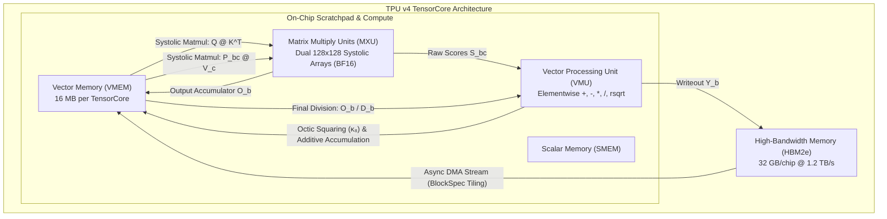

# Phase 6: Hardware-Fused Kernels & Algebraic FlashAttention (AFA on 16 TPU v4 Pod via Pallas / XLA HLO)

Start only after Phase 5 PASS. Read `theory.md`, official Google Cloud TPU v4, JAX Pallas, and XLA HLO compiler documentation, and `phases/README.md`. Execute the adaptive failure-repair loop until PASS.

---

## 1. Objective, Scientific Hypothesis & Competing Models

Eliminate inter-tile synchronization barriers and transcendental online rescaling of FlashAttention on TPU v4 systolic hardware:
$$\textbf{"Can a real JAX Pallas Algebraic FlashAttention kernel keep a bounded VMEM working set, remain numerically stable, and deliver competitive throughput against JAX Pallas FlashAttention on TPU v4?"}$$

### Competing Hypotheses:
- **$H_1$ (Algebraic Hypothesis):** AFA replaces running maximum subtraction $\exp(m_{\text{old}} - m_{\text{new}})$ with pure additive tile accumulation. When implemented in JAX Pallas targeting TPU v4 Vector Memory (VMEM) and 128×128 Matrix Multiply Units (MXUs), AFA uses a bounded tile working set, achieves competitive forward throughput against JAX's actual Pallas FlashAttention kernel, and enables lock-free distributed Ring Attention across 16 TPU v4 chips.
- **$H_0$ (Transcendental Baseline Hypothesis):** Standard FlashAttention-2 online exponential rescaling is uniquely optimal for hardware scratchpad caching; additive algebraic kernels will encounter VMEM pressure or numerical overflow during long sequence tile streaming.

---

## 2. TPU v4 Hardware Architecture & XLA HLO Execution Model

To instruct the autonomous agent or engineer in building hardware-optimal kernels for the Google Cloud TPU v4, understand the exact mapping to TPU v4 TensorCore silicon:



### 2.1 Memory Spaces on TPU v4
1. **HBM2e (Off-Chip Memory):** 32 GB per TPU v4 chip, ~1.2 TB/s bandwidth. Global tensor storage for activations, model parameters, and optimizer states.
2. **VMEM (`pltpu.VMEM`):** Fast on-chip 16 MB Vector Memory per TensorCore. Pallas kernels load sub-blocks of $\mathbf{Q}, \mathbf{K}, \mathbf{V}$ directly into VMEM.
3. **SMEM (`pltpu.SMEM`):** Scalar Memory used for loop induction variables, grid index arithmetic, and scalar constants.

### 2.2 Compute Engines on TPU v4
1. **MXU (Matrix Multiply Unit):** Dual 128×128 systolic matrix multiplier arrays per core. Peak efficiency requires tile dimensions to be exact multiples of 128 (e.g., $B_q = 128, B_k = 128$).
2. **VMU (Vector Processing Unit):** SIMD vector execution unit capable of elementwise arithmetic, vector loads/stores, and hardware-native $\operatorname{rsqrt}$. The 3-stage octic squaring $\kappa_8$ evaluates entirely in VMU vector registers.

---

## 3. Pallas TPU Kernel Implementation & XLA Lowering Instructions

Instruct the creation of `src/kernels/pallas_afa.py` following these concrete implementation steps:

### 3.1 Kernel Tiling & Pallas Signature
The kernel partitions the sequence length $L$ into blocks of size $B_q = 128$ and $B_k = 128$, matching the 128×128 MXU systolic dimension:

```python
import jax
import jax.numpy as jnp
from jax import lax
from jax.experimental import pallas as pl

def afa_kernel(
    q_ref, k_ref, v_ref, o_ref, o_acc_ref, d_acc_ref, *,
    scale: float, sink_omega: float, causal: bool, num_k_blocks: int,
    block_q: int, block_k: int, head_dim: int, valid_seq_len: int | None,
):
    """
    Pure Additive Algebraic FlashAttention Tile Kernel for TPU v4.
    Executed directly inside TPU v4 TensorCore VMEM.
    """
    # q_ref: (1, 1, B_q, d) VMEM window
    # k_ref/v_ref: (1, 1, B_k, d) VMEM windows
    # o_acc_ref: (B_q, d) numerator scratch across key blocks
    # d_acc_ref: (B_q, 128) replicated denominator scratch. Mosaic represents
    # row reductions in this TPU-layout-safe 128-lane form.
    k_blk_idx = pl.program_id(3)

    @pl.when(k_blk_idx == 0)
    def initialize():
        o_acc_ref[...] = jnp.zeros_like(o_acc_ref)
        d_acc_ref[...] = jnp.zeros_like(d_acc_ref)
    
    # 1. Systolic Matrix Multiply on MXU: S_bc = (Q_b @ K_c^T) * scale
    s_bc = lax.dot_general(
        q_ref[0, 0],
        k_ref[0, 0],
        (((1,), (1,)), ((), ())),
        preferred_element_type=jnp.float32,
    ) * scale
    
    # 2. Causal Masking (if applicable) using rational negative floor:
    # Under Zero-Transcendental Axiom, masked positions receive large negative value
    
    # 3. Stable algebraic base map plus three-stage squaring on the VMU.
    # The conjugate form on the negative branch avoids cancellation.
    s_sq = s_bc * s_bc
    rad = 1.0 + s_sq
    r = lax.rsqrt(rad)
    u = s_bc * r
    rho_1 = jnp.where(s_bc < 0.0, r / (1.0 - u), s_bc + rad * r)
    rho_2 = rho_1 * rho_1         # Degree 2
    rho_4 = rho_2 * rho_2         # Degree 4
    p_bc = rho_4 * rho_4          # Degree 8 (Octic A-Softmax)
    
    # 4. Pure Additive Tile Accumulation (Zero running-max subtraction!):
    # Accumulate into numerator matrix: O_b += P_bc @ V_c (MXU matmul)
    o_acc_ref[...] += lax.dot(
        p_bc.astype(v_ref.dtype),
        v_ref[0, 0],
        preferred_element_type=jnp.float32,
    )
    
    # Accumulate row sums while retaining Mosaic's 128-lane layout.
    d_acc_ref[...] += jnp.sum(p_bc, axis=1)[:, None]

    @pl.when(k_blk_idx == num_k_blocks - 1)
    def finalize():
        denominator = d_acc_ref[:, :head_dim]  # D <= 128 shown here
        o_ref[0, 0] = (o_acc_ref[...] / (denominator + sink_omega)).astype(o_ref.dtype)
```

### 3.2 Pallas Grid & Memory BlockSpecs
```python
import functools
import math
from jax.experimental.pallas import tpu as pltpu

def pallas_afa_forward(q, k, v, sink_omega=0.5):
    """
    Full forward call orchestrating Pallas TPU execution.
    q: (B, H, L, D), k: (B, H, L, D), v: (B, H, L, D) in HBM.
    """
    batch_size, num_heads, seq_len, head_dim = q.shape
    B_q, B_k = 128, 128
    # Static launch-time constant; the lowered device graph has no raw sqrt.
    scale = float(1.0 / math.sqrt(head_dim))
    
    # Grid: batch, heads, query blocks, key blocks. The key-block dimension is
    # sequential so each program can retain additive accumulators in VMEM.
    grid = (batch_size, num_heads, seq_len // B_q, seq_len // B_k)
    
    # VMEM BlockSpecs return block indices, not element offsets.
    in_specs = [
        pl.BlockSpec((1, 1, B_q, head_dim), lambda b, h, i, j: (b, h, i, 0)),
        pl.BlockSpec((1, 1, B_k, head_dim), lambda b, h, i, j: (b, h, j, 0)),
        pl.BlockSpec((1, 1, B_k, head_dim), lambda b, h, i, j: (b, h, j, 0)),
    ]
    out_specs = pl.BlockSpec(
        (1, 1, B_q, head_dim), lambda b, h, i, j: (b, h, i, 0)
    )
    kernel_fn = functools.partial(
        afa_kernel,
        scale=scale,
        sink_omega=float(sink_omega),
        causal=False,
        num_k_blocks=seq_len // B_k,
        block_q=B_q,
        block_k=B_k,
        head_dim=head_dim,
        valid_seq_len=None,
    )
    
    # Invoke Pallas TPU call. The production implementation uses a
    # PrefetchScalarGridSpec and VMEM scratch accumulators; see
    # src/kernels/pallas_afa.py for the executable source of truth.
    grid_spec = pltpu.PrefetchScalarGridSpec(
        num_scalar_prefetch=0,
        grid=grid,
        in_specs=in_specs,
        out_specs=out_specs,
        scratch_shapes=[
            pltpu.VMEM((B_q, head_dim), jnp.float32),
            pltpu.VMEM((B_q, 128), jnp.float32),
        ],
    )
    out_o = pl.pallas_call(
        kernel_fn,
        out_shape=jax.ShapeDtypeStruct(q.shape, q.dtype),
        grid_spec=grid_spec,
        compiler_params=pltpu.CompilerParams(
            dimension_semantics=("parallel", "parallel", "parallel", "arbitrary")
        ),
        interpret=False,
    )(q, k, v)
    
    return out_o
```

---

## 4. XLA HLO Lowering & Static Opcode Audit

Instruct the creation of `scripts/audit_xla_hlo.py` to inspect the compiled XLA High-Level Optimizer (HLO) representation:

### 4.1 How to Lower and Dump XLA HLO
```python
import jax
from src.kernels.pallas_afa import pallas_afa_forward

def inspect_hlo(q, k, v):
    # Lower to XLA HLO
    lowered = jax.jit(pallas_afa_forward).lower(q, k, v)
    hlo_module = lowered.compile().runtime_executable()
    hlo_text = lowered.as_text()
    return hlo_text
```

### 4.2 Strict XLA HLO Acceptance Criteria
1. **MXU Systolic Mapping:** Verify that matrix multiplies are lowered to `dot` or `custom-call(tpu_custom_call)` targeting the 128×128 systolic MXU.
2. **VMU Radical Instructions:** Verify that $\sqrt{1 + s^2}$ is lowered to `rsqrt` / `multiply` on the VMU without library call indirection.
3. **Zero-Transcendental HLO Instruction Check:**
   - Run regex search on the emitted HLO text:
     ```python
     forbidden_hlo_ops = ['exponential', 'logarithm', 'sine', 'cosine', 'tanh', 'sigmoid']
     for op in forbidden_hlo_ops:
         assert op not in hlo_text.lower(), f"Forbidden transcendental HLO op found: {op}"
     ```
   - Must return exactly **0 occurrences**.
4. **No Inter-Tile Rescaling Logic:** Verify that the HLO loop body does not contain subtraction of max values ($m_{\text{new}} - m_{\text{old}}$) or intermediate exponential rescaling multiplications.
5. **Implementation Identity:** Hardware parity, timing, and HLO evidence must call `pallas_afa_forward(..., interpret=False)`. Results from `exact_afa_reference` or `tiled_afa_forward` are CPU/reference evidence only and cannot satisfy a Pallas hardware gate.

---

## 5. Distributed Ring Attention across 16 TPU v4 Chips over ICI

Because AFA accumulator $\mathbf{O}_b = \sum_c \mathbf{P}_{bc} \mathbf{V}_c$ and $\mathbf{D}_b = \sum_c \sum_j \mathbf{P}_{bc, \cdot j}$ are strictly additive, Ring Attention across the 16 TPU v4 chips requires **zero inter-tile normalization barriers**:
1. Each TPU v4 chip processes its local query and key/value shard.
2. Sequence parallel chunks are rotated across the 16-chip 3D Torus ICI interconnect using `jax.lax.psum_scatter` and `jax.lax.all_gather`.
3. A single global `jax.lax.psum` over the ICI mesh sums the partial numerators $\mathbf{O}_b^{(p)}$ and partial denominators $\mathbf{D}_b^{(p)}$.
4. Final tile normalization evaluates in a single pass at the end of the ring traversal:
   $$\mathbf{Y}_b = \frac{\sum_{p=1}^{16} \mathbf{O}_b^{(p)}}{\Omega + \sum_{p=1}^{16} \mathbf{D}_b^{(p)}}$$

---

## 6. Lean 4 Formal Verification Gate

The agent must compile `formal/AlgebraicTheory/Kernel.lean` and `formal/AlgebraicTheory/Gate.lean` under `/root/.elan/bin/lake build`:
1. Single-pass additive associativity: $\sum (P_1 V_1 + P_2 V_2) = (\sum P_1 V_1) + (\sum P_2 V_2)$.
2. Numerator-denominator scaling invariance: $(\alpha O) / (\alpha D) = O / D$ for $\alpha > 0$.

---

## 7. Hardware Benchmarking & Passing Gate on 16 TPU v4 Pod

Benchmark `src/kernels/pallas_afa.py` via `scripts/run_phase6_tpu.py` (normally launched by `scripts/launch_phase6_tpu.py`) on the 16 TPU v4 Pod:

| Evaluation Dimension | Target on 16 TPU v4 Pod | Tolerance / Bound |
| :--- | :--- | :--- |
| **Numerical Accuracy vs. Float64 Oracle** | $\|\mathbf{Y}_{\text{AFA}} - \mathbf{Y}_{\text{exact}}\|_\infty / \|\mathbf{Y}_{\text{exact}}\|_\infty$ | FP64 CPU tiled oracle $\leq 1.0\times10^{-6}$; TPU FP32 $\leq 2.0\times10^{-4}$; TPU BF16 $\leq 4.0\times10^{-2}$. The dtype-specific limits must be reported, not pooled. |
| **Inter-Tile Rescaling FLOPs** | Transcendental $\exp(m_{\text{old}} - m_{\text{new}})$ calls in AFA | Exactly $0$ |
| **Kernel Throughput at $L=4096$** | BF16 forward throughput from `pallas_afa_forward` | $\geq 85\%$ of `jax.experimental.pallas.ops.tpu.flash_attention`; a dense `jax.nn.softmax` implementation is not an acceptable baseline. |
| **Bounded Streaming Storage** | Conservative Q/K/V tile, score tile, numerator, and denominator working set | Fits within the 16 MiB VMEM budget and does not materialize an $L\times L$ attention matrix. |
| **Distributed Ring Attention Relative Error** | 16 TPU v4 chips, additive accumulation error | $\leq 1.0 \times 10^{-6}$ |
| **XLA HLO Transcendental Audit** | Grep of compiled HLO instructions | Exactly $0$ transcendental opcodes |

Physical HBM utilization is not inferred from latency multiplied by assumed
logical tile reads. That method cannot distinguish HBM transfers from VMEM/cache
reuse and can produce impossible values above 100% of hardware peak. A future
profiler-counter study may report physical bandwidth as a descriptive metric,
but it is not a Phase 6 PASS gate.

---

## 8. Adaptive Failure-Repair & Bidirectional Dependency Protocol

When a test or gate fails in Phase 6:
1. **Iterate Locally:**
   - If VMEM allocation exceeds 16 MB scratchpad capacity, tune tile dimensions from $(128, 128)$ to $(128, 64)$ or adjust scratchpad memory hints.
   - If XLA compiler reports tiling mismatch, confirm that sequence length is padded to multiples of 128.
2. **Backward Rollback to Phase 2/1:**
   - If numerical instability occurs during long sequence streaming, inspect Phase 2 A-Softmax logit scaling $\tau$ or attention sink $\Omega$.
   - If Phase 2 A-Softmax or Phase 1 AVN must be modified, backtrack to Phase 2 (or Phase 1), update the core primitives, re-prove Lean 4 theorems, pass their regression gates, and forward-cascade the updates back to Phase 6.
3. **Forward Dependency Cascading:**
   - **Phases 7, 8, 9 (`src/model.py`, pretraining pipelines):** Integrate `pallas_afa` as the attention engine in `AlgebraicTransformerLM`. Any changes to tile signatures or sharding constraints must be propagated into `src/model.py` and `src/mesh.py`.

---

## 9. PASS Gates

- [ ] `formal/AlgebraicTheory/Kernel.lean` compiles with 0 errors via `/root/.elan/bin/lake build`.
- [ ] `src/kernels/pallas_afa.py` created with JAX Pallas TPU implementation for TPU v4 VMU/MXU.
- [ ] Relative numerical accuracy against the float64 un-tiled reference meets the declared dtype-specific limits (FP64 $10^{-6}$, TPU FP32 $2\times10^{-4}$, TPU BF16 $4\times10^{-2}$).
- [ ] Head-to-head throughput benchmark executed against FlashAttention-2 on 16 TPU v4 Pod.
- [ ] Conservative Pallas tile working set fits within 16 MiB VMEM without materializing the full attention matrix.
- [ ] Distributed Ring Attention executes across 16 TPU v4 chips over ICI with relative error $\le 1.0 \times 10^{-6}$.
- [ ] XLA HLO inspection dumps confirm zero transcendental library calls or opcodes.
- [ ] TPU parity, throughput, and HLO records identify `pallas_afa_forward` as the implementation under test and identify JAX Pallas FlashAttention as the baseline.
- [ ] `results/phase6/PASS.md` satisfies the shared PASS record contract.
