# Phase 7: Full Architecture Assembly & Pilot Pretraining (15M LM on WikiText-103)

Start only after Phase 6 PASS. Read `theory.md`, Phase 1–6 evidence in `results/phase1/` through `results/phase6/`, and `phases/README.md` completely before executing. Execute the shared adaptive failure-repair loop until all gates pass.

---

## 1. Objective, Scientific Hypothesis & Competing Models

Assemble the complete, end-to-end **Algebraic Transformer** (`AlgebraicTransformerLM`) integrating all verified Phase 1–6 primitives into a unified causal language model, and conduct an empirical head-to-head pilot pretraining study against an equal-budget **Standard Causal Transformer** (`StandardTransformerLM`) on the dedicated **16 TPU v4 Pod slice (512 GB aggregate HBM)**:
$$\textbf{"Can pure algebraic primitives compose into an end-to-end language model that converges stably and matches the standard Transformer?"}$$

### Competing Hypotheses:
- **$H_1$ (Algebraic Hypothesis):** The assembled Algebraic Transformer (ALU-GLU, AVN, A-Softmax + Pallas AFA, AGO Cayley rotations, OACE $\mathcal{L}_{1/8}$, and ACO factorized curvature optimization + ARDS rational decay) achieves seamless forward-backward gradient flow across stacked layers, exhibits zero gradient singularities via OACE, maintains activation norm stability via parameter-free AVN, and achieves validation perplexity within $\le 1.08\times$ of the Standard Transformer baseline on WikiText-103 while consuming $\ge 45\%$ less optimizer state memory in HBM.
- **$H_0$ (Transcendental Baseline Hypothesis):** Stacking non-exponential algebraic primitives across multiple layers will cause deep signal degradation, gradient vanishing/explosion, or optimization stalling due to non-exponential softmax contrast or non-logarithmic loss gradients, resulting in divergence or severe perplexity collapse relative to the SwiGLU + RMSNorm + Softmax + AdamW baseline.

---

## 2. Architecture Specifications & Matched-Budget Configurations

Preregister and freeze both model architectures at the **15M parameter pilot scale** before launching training:

```mermaid
graph TD
    subgraph "Pure Algebraic Transformer (Ours)"
        In1["Token IDs"] --> Emb1["Token Embedding + AVN"]
        Emb1 --> Blk1["L Block Layers (x 6)"]
        subgraph "Algebraic Block"
            Blk1 --> NormA1["AVN (Parameter-Free)"]
            NormA1 --> Attn1["A-Softmax (κ₈) + AGO Cayley + Pallas AFA"]
            Attn1 --> Add1["Additive Residual (+)"]
            Add1 --> NormA2["AVN (Parameter-Free)"]
            NormA2 --> FFN1["ALU-GLU (Horner Cubic Backward)"]
            FFN1 --> Add2["Additive Residual (+)"]
        end
        Add2 --> FinalNorm1["Final AVN"]
        FinalNorm1 --> Head1["Linear Un-embedding"]
        Head1 --> Loss1["OACE Loss (L₁/₈ via 3 rsqrt)"]
        Loss1 --> Opt1["ACO Optimizer + ARDS Schedule"]
    end

    subgraph "Standard Causal Transformer (Baseline)"
        In2["Token IDs"] --> Emb2["Token Embedding + RMSNorm"]
        Emb2 --> Blk2["L Block Layers (x 6)"]
        subgraph "Standard Block"
            Blk2 --> NormB1["RMSNorm (Learnable γ)"]
            NormB1 --> Attn2["Exp Softmax + RoPE (sin/cos) + FA-2"]
            Attn2 --> Add3["Additive Residual (+)"]
            Add3 --> NormB2["RMSNorm (Learnable γ)"]
            NormB2 --> FFN2["SwiGLU (x · sigmoid(x))"]
            FFN2 --> Add4["Additive Residual (+)"]
        end
        Add4 --> FinalNorm2["Final RMSNorm"]
        FinalNorm2 --> Head2["Linear Un-embedding"]
        Head2 --> Loss2["Cross-Entropy Loss (-ln p)"]
        Loss2 --> Opt2["AdamW + Cosine Schedule"]
    end
```

### 2.1 Model Hyperparameters (Exact Parity)
- **Parameter Count:** $\approx 15\text{M}$ parameters (matched within $\pm 1\%$ across architectures, excluding parameter-free AVN parameter savings).
- **Hidden Dimension ($d_{\text{model}}$):** $288$.
- **Number of Layers ($L$):** $6$.
- **Attention Heads ($H$):** $6$ ($d_k = d_v = 48$ per head).
- **FFN Intermediate Dimension ($d_{\text{ff}}$):** $768$ ($8/3 \times d_{\text{model}}$).
- **Vocabulary Size ($V$):** $50,257$ (GPT-2 standard BPE tokenizer).
- **Context Length ($T$):** $512$ tokens.
- **Dataset:** WikiText-103 raw character-level / BPE tokens ($10^5$ training steps).
- **Global Batch Size:** $32,768$ tokens ($64$ sequences $\times 512$ context tokens), distributed across the 16 TPU v4 chips via JAX data-parallel sharding.

### 2.2 Component Breakdown
| Architectural Subsystem | Pure Algebraic Transformer (`AlgebraicTransformerLM`) | Standard Causal Transformer (`StandardTransformerLM`) |
| :--- | :--- | :--- |
| **Activation Function** | ALU: $K(x) = \frac{x}{2}(1 + x \cdot \operatorname{rsqrt}(1 + x^2))$ | Swish: $x \cdot \sigma(x) = x / (1 + e^{-x})$ |
| **FFN Gating** | ALU-GLU: $\mathbf{W}_d [(\mathbf{W}_g \mathbf{x}) \odot K(\mathbf{W}_u \mathbf{x})]$ | SwiGLU: $\mathbf{W}_d [(\mathbf{W}_g \mathbf{x}) \odot \operatorname{Swish}(\mathbf{W}_u \mathbf{x})]$ |
| **Normalization** | Parameter-Free AVN: $\mathbf{x} \cdot \operatorname{rsqrt}(m_2(\mathbf{x}) + \epsilon)$ | RMSNorm with learnable $\boldsymbol{\gamma} \in \mathbb{R}^d$ |
| **Attention Kernel** | Octic A-Softmax: $\kappa_8(s) = (s + \sqrt{1 + s^2})^8$ with $\Omega = 0.5$ | Exponential Softmax: $\exp(s) / \sum \exp(s_j)$ |
| **Positional Encoding** | AGO: Cayley rotation $\mathbf{R}_k = (\mathbf{I} + \omega_k \mathbf{J})(\mathbf{I} - \omega_k \mathbf{J})^{-1}$ | RoPE: Trigonometric rotation $(\cos(m\theta), \sin(m\theta))$ |
| **Attention Execution** | Fused Pallas AFA kernel (pure additive accumulation on TPU v4) | FlashAttention-2 (running max rescaling) |
| **Training Loss Functional** | OACE: $\mathcal{L}_{1/8}(p_k) = 8(p_k^{-1/8} - 1)$ scaled by $\gamma = 2.0$ | Cross-Entropy: $\mathcal{L}_{\text{CE}} = -\ln p_k$ |
| **Optimizer** | ACO: Factorized $\mathcal{O}(d_{\text{out}} + d_{\text{in}})$ curvature preconditioning | AdamW: Full elementwise second moments $\mathbf{v} \in \mathbb{R}^{d_{\text{out}} \times d_{\text{in}}}$ |
| **Learning Rate Schedule** | ARDS: $\eta_t = \eta_0 \cdot \operatorname{rsqrt}(1 + \alpha t^2)$ | Cosine Annealing: $\eta_t = \eta_{\min} + \frac{1}{2}(\eta_0 - \eta_{\min})(1 + \cos(\pi t / T))$ |

---

## 3. Implementation Target: JAX / TPU v4 Architecture

Instruct the creation and verification of the following files targeting the 16 TPU v4 Pod:
1. **`src/model.py`**:
   - `AlgebraicTransformerLM`: Flax / JAX full model integrating `alu_glu`, parameter-free `avn`, `a_softmax` with `pallas_afa`, `apply_ago_rotations`, `oace_loss`, and `aco_optimizer`.
   - `StandardTransformerLM`: Baseline model implementing SwiGLU, RMSNorm with learnable $\boldsymbol{\gamma}$, exponential Softmax, RoPE, cross-entropy, and AdamW.
2. **`src/mesh.py`**:
   - SPMD distributed sharding topology defining 16 TPU v4 devices in a 3D Torus mesh via `jax.sharding.Mesh` with axes `('data', 'fsdp', 'model')`.
3. **`scripts/run_pilot_15m.py`**:
   - End-to-end distributed pretraining script for 15M models across $10^5$ steps on 16 TPU v4 chips, logging validation perplexity, gradient norms, and HBM memory.

---

## 4. Lean 4 Formal Verification Gate

Compile `formal/AlgebraicTheory/Composition.lean` and `formal/AlgebraicTheory/Gate.lean` under `/root/.elan/bin/lake build`:
1. **End-to-End Bounded Signal Propagation:** Prove that the composition of AVN and ALU-GLU preserves coordinate bounds:
   $$\forall \mathbf{x} \in \mathbb{R}^d, \quad \|\operatorname{AVN}(\mathbf{x})\|_\infty \le \sqrt{d}$$
2. **Residual Invariant:** Prove that additive residual connections $\mathbf{x}_{\ell+1} = \mathbf{x}_\ell + \operatorname{SubLayer}(\operatorname{AVN}(\mathbf{x}_\ell))$ have bounded variance growth under Lipschitz-continuous sublayers.

---

## 5. Hardware Pilot Pretraining Suite on 16 TPU v4 Pod

Execute pretraining across $10^5$ steps distributed across the 16 TPU v4 chips via `scripts/run_pilot_15m.py`:

| Verification Dimension | Evaluation Target / Protocol | Acceptance Gate |
| :--- | :--- | :--- |
| **Validation Perplexity Parity** | Held-out WikiText-103 perplexity: $\text{PPL}_{\text{alg}} / \text{PPL}_{\text{base}}$ | $\leq 1.08\times$ |
| **Numerical Stability & Divergence** | NaN or Inf occurrence count over $10^5$ steps | Exactly $0$ |
| **Loss Spike Anomaly Count** | Step transitions with sudden loss spike $\Delta \mathcal{L} > 1.5$ | Exactly $0$ |
| **Peak Gradient Norm** | $\max_{t \in [1, 10^5]} \|\mathbf{g}_t\|_2$ under BF16 with FP32 master weights | $\leq 5.0$ |
| **Optimizer Memory Footprint** | Peak HBM bytes allocated for optimizer states (ACO vs. AdamW) | $\geq 45\%$ memory reduction |
| **Steady-State Throughput** | Tokens/second during distributed pretraining loop on 16 TPU v4 chips | $\geq 90\%$ of baseline throughput |
| **Zero-Transcendental AST Audit** | Static AST inspection of all forward, backward, loss, and optimizer paths | Exactly $0$ transcendentals |

---

## 6. Adaptive Failure-Repair & Bidirectional Dependency Protocol

When an architectural or convergence failure occurs during pilot pretraining:
1. **Upstream Dependency Rollback:**
   - **Gradient vanishing/explosion across depth:** Backtrack to **Phase 1**, introduce rational depth attenuation $\mathbf{x}_{\ell+1} = \mathbf{x}_\ell + \operatorname{rsqrt}(2L) \cdot \operatorname{SubLayer}(\operatorname{AVN}(\mathbf{x}_\ell))$, re-run Phase 1 gates, and cascade the update forward through Phase 6 to Phase 7.
   - **Early training divergence:** Backtrack to **Phase 5**, calibrate rational learning rate warmup $\eta_t = \eta_0 \frac{t}{T_{\text{warm}}}$, or enforce diagonal damping $\epsilon_{\text{curv}}$ in ACO.
   - **Attention logit explosion:** Backtrack to **Phase 2**, verify logit scaling $\tau = \operatorname{rsqrt}(d_k)$ and attention sink $\Omega$.
2. **Forward Dependency Cascading:**
   - The verified `AlgebraicTransformerLM` configuration, sharding specification in `src/mesh.py`, and training hyperparameters establish the foundational template for **Phase 8 (125M / 1.0B tokens)** and **Phase 9 (350M / 3.0B tokens)**.
   - Any architectural amendment made in Phase 7 must be immediately reflected in Phase 8 and Phase 9 specifications.

---

## 7. PASS Gates

- [ ] Complete pilot pretraining run of `AlgebraicTransformerLM` (15M parameters) executes for $10^5$ steps on WikiText-103 on 16 TPU v4 chips with zero NaNs, zero Infs, and zero divergent loss spikes.
- [ ] Matched-budget `StandardTransformerLM` baseline executes under identical token order and optimization budget.
- [ ] Algebraic Transformer validation perplexity achieves parity within $\le 1.08\times$ of the baseline.
- [ ] Peak gradient norm satisfies $\max_t \|\mathbf{g}_t\|_2 \le 5.0$ throughout the entire $10^5$-step trajectory.
- [ ] Hardware measurements on 16 TPU v4 Pod confirm $\ge 45\%$ lower optimizer memory footprint for ACO compared to AdamW.
- [ ] Full AST audit verifies exactly 0 calls to transcendental functions (`exp`, `log`, `sin`, `cos`) in production code.
- [ ] Formal Lean 4 verification compiles cleanly via `/root/.elan/bin/lake build`.
- [ ] All inherited Phase 1–6 gates pass without regression.
- [ ] `results/phase7/PASS.md` satisfies the shared PASS record contract.
