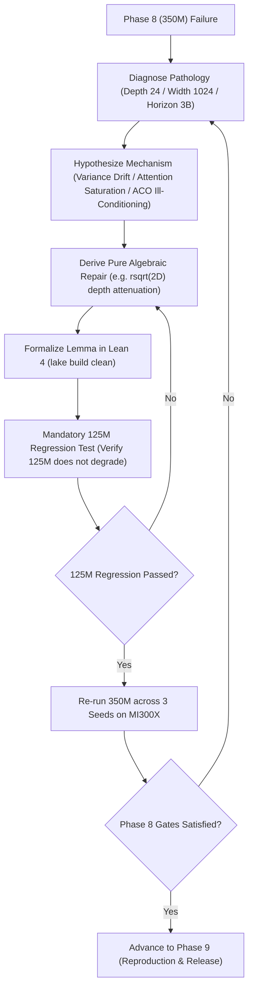

# Phase 8 — 350M Medium-Scale Pretraining & Scaling Law Study (3.0B FineWeb-Edu Tokens)

Start only after Phase 7 PASS. Read all prior artifacts and `phases/AUTONOMY_PROTOCOL.md`. Execute the failure-repair loop until PASS.

This phase scales model capacity to **350M parameters** ($2\times$ depth, 24 layers, width 1024) and pretrains on **3.0 Billion tokens of FineWeb-Edu** on the dedicated **1x AMD Instinct MI300X GPU (192 GB HBM3)**. It tests whether pure algebraic architectures obey predictable neural scaling laws and maintain deep gradient stability without transcendental saturation.

---

## 1. Frozen Experimental Design

Preregister and freeze the medium-scale configuration:

- **Model Scale:** **350M parameters** ($d_{\text{model}} = 1024$, $\text{heads} = 16$, $\text{layers} = 24$, $d_k = 64, d_v = 64$, FFN dimension $2816$, vocabulary size $50,257$);
- **Dataset & Token Budget:** Exactly **3.0 Billion training tokens** per model drawn from **FineWeb-Edu**;
- **Hardware Target:** Dedicated 1x AMD Instinct MI300X GPU (`gfx942`, 192 GB HBM3, 5.3 TB/s bandwidth).
  - *VRAM Advantage:* Total static state is $< 2.2\text{ GB}$, leaving over $189\text{ GB}$ of local HBM3 for large micro-batches without multi-node pipeline stalls;
- **Architectures Compared:**
  1. **Pure Algebraic Transformer (`AlgebraicTransformerLM` 350M):** ALU-GLU, A-Softmax ($\kappa_8$, $\Omega=0.5$), AGO Cayley rotations, AVN, OACE ($\mathcal{L}_{1/8}$), ACO factorized curvature + ARDS schedule;
  2. **Standard Causal Transformer Baseline (350M):** SwiGLU, Exponential Softmax, RoPE, RMSNorm, Cross-Entropy, AdamW + Cosine Annealing;
  3. **Competitive SSM-Attention Hybrid (350M):** Mamba-2 style selective scan + Attention, SwiGLU, RMSNorm, AdamW;
- **Paired Seeds:** Run across three identical random seeds (Seed 42, Seed 1337, Seed 2026);
- **Training Protocol:** Identical FineWeb-Edu shards, global batch size $\approx 1.05 \times 10^6$ tokens (512 sequences of context length 2048), BF16 precision with FP32 accumulation, checkpoint cadence every 100M tokens;
- **Budget Parity:** Parameters within $\pm 1\%$, training tokens identical, optimizer step counts identical.

---

## 2. Scaling Law & Deep Stability Evaluation

Evaluate all completed 350M runs across:

1. **Empirical Neural Scaling Laws:**
   - Measure loss reduction $\Delta \mathcal{L} = \mathcal{L}_{125\text{M}} - \mathcal{L}_{350\text{M}}$;
   - Confirm parallel power-law scaling: verify that the Algebraic Stack exhibits a scaling exponent $\alpha$ matching or exceeding the Standard Transformer baseline ($L(N) \propto N^{-\alpha}$);
   - Plot Compute FLOPs vs. Validation Loss for both architectures.
2. **Deep 24-Layer Network Stability:**
   - Track activation variance $\operatorname{Var}(\mathbf{h}_\ell)$ across all 24 layers from layer 1 to 24;
   - Verify that parameter-free AVN prevents exponential signal amplification across 24 layers ($(1.0445)^{24} \approx 2.87$ maximum theoretical drift);
   - Confirm zero loss spikes ($\Delta \mathcal{L} > 1.5$) and zero gradient explosions over the full 3B token pretraining trajectory.
3. **Long-Context Retrieval & Needle-In-A-Haystack (NIAH):**
   - Multi-needle retrieval benchmarks across context lengths $\{2048, 4096, 8192\}$;
   - Confirm that AGO Cayley rotations maintain $> 95\%$ needle retrieval accuracy at extended context.
4. **Systems & Inference Telemetry on MI300X:**
   - Prefill throughput (tok/s) and per-token decode latency (ms/tok);
   - Peak VRAM allocation;
   - Optimizer memory state bytes: Verify factorized second-moment compression of $\approx 2048\times$ at width 1024, saving $> 45\%$ total optimizer memory in HBM.

---

## 3. Hierarchical Scaling Back-Propagation Loop

If the 125M model succeeded in Phase 7, but the 350M model fails in Phase 8, the autonomous agent must execute the **Hierarchical Scaling Back-Propagation Protocol**:

### Specific 350M Diagnostics:
1. **Vanishing / Exploding Gradients Across 24 Layers:** Apply rational depth attenuation: $\mathbf{x}_{\ell+1} = \mathbf{x}_\ell + \operatorname{rsqrt}(2 D) \cdot \operatorname{SubLayer}(\operatorname{AVN}(\mathbf{x}_\ell))$.
2. **Attention Entropy Saturation at Width $d=1024$:** Calibrate query-key scale factor $\tau = \frac{1}{\sqrt{d_k}} \operatorname{rsqrt}(1 + \mu)$ or adjust attention sink $\Omega$.
3. **ACO Preconditioner Ill-Conditioning:** Enforce algebraic diagonal damping $\hat{\mathbf{V}}_{ij} \leftarrow \hat{\mathbf{V}}_{ij} + \epsilon_{\text{curv}} \bar{r} \mathbf{I}$.
4. **Mandatory 125M Regression Check:** Any change made to fix 350M must be evaluated on the 125M model to confirm zero performance regression. Both scales must simultaneously pass.

---

## PASS Gates

- [ ] All 3 random seed runs for 350M Algebraic Transformer and 350M Baseline Transformer complete the full 3.0B token budget with zero unhandled NaNs or divergence.
- [ ] Algebraic Transformer validation perplexity achieves parity with the Standard Transformer baseline within $\le 1.08\times$ (mean over 3 seeds).
- [ ] Parallel power-law scaling confirmed: Loss reduction from 125M to 350M satisfies $\Delta \mathcal{L}_{\text{alg}} \approx \Delta \mathcal{L}_{\text{base}}$.
- [ ] Zero loss spikes ($\Delta \mathcal{L} > 1.5$) or gradient explosions across all 24 layers over 3.0B tokens.
- [ ] Multi-needle passkey retrieval achieves $\ge 90.0\%$ accuracy at context lengths $\ge 4096$ tokens.
- [ ] Hardware measurements confirm $\ge 45\%$ lower total optimizer memory footprint for ACO vs. AdamW at 350M scale.
- [ ] Mandatory 125M regression check passes with zero performance degradation.
- [ ] All Lean 4 formal proofs compile cleanly via `/root/.elan/bin/lake build`.
- [ ] All inherited Phase 0–7 gates pass.
- [ ] `results/phase8/PASS.md` satisfies the shared PASS record contract.
