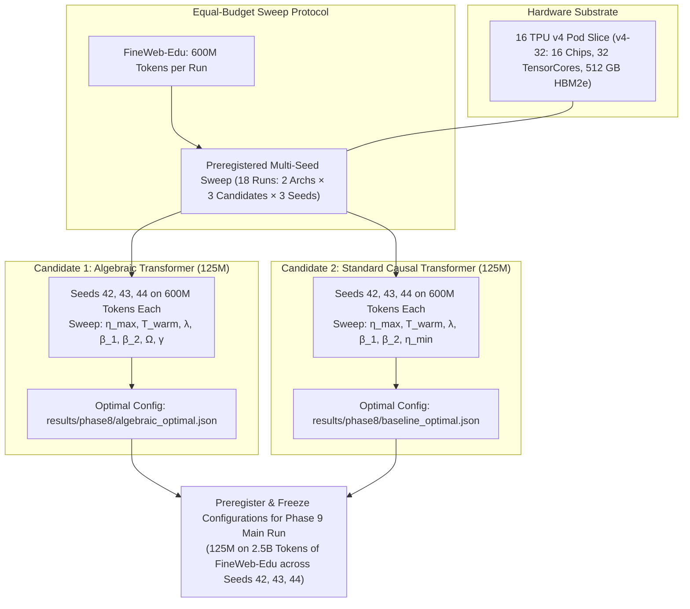

# Phase 8: Systematic Hyperparameter Sweeping & Architecture Tuning

Start only after Phase 7 PASS. Read `theory.md`, Phase 7 evidence in `results/phase7/`, and `phases/README.md` completely before executing. Execute the shared adaptive failure-repair loop until all gates pass.

---

## 1. Objective, Scientific Hypothesis & Competing Models

Conduct a rigorous, equal-budget **hyperparameter sweep and architecture tuning study** at the **125M parameter scale** on FineWeb-Edu for both the Pure Algebraic Transformer (`AlgebraicTransformerLM`) and the Standard Causal Transformer (`StandardTransformerLM`):
$$\textbf{"Which preregistered configuration for each architecture gives the lowest stable validation loss across 3 seeds after at least 600M tokens per run?"}$$

### Competing Hypotheses:
- **$H_1$ (Fair Calibration Hypothesis):** Independently evaluating three preregistered configurations per architecture under identical evaluation token budgets (at least 600M tokens of FineWeb-Edu per run across Seeds 42, 43, and 44, totaling 18 runs) on the 16 TPU v4 Pod slice (v4-32) reduces tuning bias before Phase 9.
- **$H_0$ (Confounding Sensitivity Hypothesis):** Pure algebraic primitives are hypersensitive to hyperparameter selection across seeds, requiring disproportionate tuning effort or failing to achieve stable convergence across seeds relative to well-established AdamW + Cosine baselines.

---

## 2. Equal-Budget Multi-Seed Hyperparameter Search Protocol

To enforce strict scientific neutrality, both candidate architectures receive an **identical multi-seed evaluation budget**:
- **2 Architectures**: `AlgebraicTransformerLM` and `StandardTransformerLM`.
- **3 Random Seeds**: **Seed 42, Seed 43, and Seed 44**.
- **Candidate Matrix**: Three preregistered configurations per architecture in `phases/phase8_candidates.json`; every candidate runs on every seed.
- **Token Budget per Run**: At least **600 Million tokens** drawn from the FineWeb-Edu corpus (`HuggingFaceFW/fineweb-edu`). Full batches round upward, so batch 512 at context 2048 executes 573 steps and 600,834,048 tokens.
- **Total Minimum Volume**: $2 \text{ architectures} \times 3 \text{ candidates} \times 3 \text{ seeds} = \mathbf{18\text{ complete sweep runs}}$ (at least $\mathbf{10.8\text{ Billion tokens}}$ evaluated).
- **Target Hardware**: Dedicated 4-host Cloud TPU v4-32 Pod slice (16 physical TPU v4 chips, 32 TensorCore devices, 512 GB aggregate unified HBM2e) in `us-central2-b`.
- **Subsequent Main Pretraining**: The winning configurations are frozen into `results/phase8/algebraic_optimal.json` and `results/phase8/baseline_optimal.json` to directly govern **Phase 9** (125M parameters on **2.5 Billion tokens** of FineWeb-Edu per run across Seeds 42, 43, and 44).



### 2.1 Preregistered Search Dimensions
The committed candidate matrix samples the following bounded dimensions. Phase 8 evaluates the matrix as written; changing it requires a new committed snapshot and invalidates prior evidence.

| Parameter | Pure Algebraic Transformer (`AlgebraicTransformerLM`) | Standard Causal Transformer (`StandardTransformerLM`) |
| :--- | :--- | :--- |
| **Peak Learning Rate ($\eta_{\max}$)** | $[1.0 \times 10^{-4}, 2.0 \times 10^{-3}]$ (Log-uniform) | $[1.0 \times 10^{-4}, 2.0 \times 10^{-3}]$ (Log-uniform) |
| **Warmup Steps ($T_{\text{warm}}$)** | Positive integer, preregistered per candidate | Positive integer, preregistered per candidate |
| **Decoupled Weight Decay ($\lambda$)** | $\{0.001, 0.01, 0.05, 0.10\}$ | $\{0.01, 0.05, 0.10, 0.15\}$ |
| **First-Moment Momentum ($\beta_1$)** | $\{0.85, 0.90, 0.95\}$ (Rational polynomial) | $\{0.85, 0.90, 0.95\}$ (Standard AdamW) |
| **Second-Moment Factor ($\beta_2$)** | $\{0.95, 0.98, 0.99, 0.999\}$ (Algebraic AdamW) | $\{0.95, 0.98, 0.99, 0.999\}$ (Standard AdamW) |
| **Attention Sink ($\Omega$)** | $\{0.1, 0.25, 0.5, 1.0, 2.0\}$ | N/A |
| **Loss Calibration Scale ($\gamma$)** | $\{1.0, 1.5, 2.0, 3.0\}$ (OACE multiplier) | N/A |
| **Schedule Minimum ($\eta_{\min}$)** | Asymptotic $\mathcal{O}(1/\sqrt{T})$ (ARDS) | $\{1.0 \times 10^{-5}, 5.0 \times 10^{-5}\}$ (Cosine) |

### 2.2 Objective Function & Selection Criterion
- **Primary Metric:** Validation loss / perplexity on held-out FineWeb-Edu validation split at the end of each 600M-token budget across Seeds 42, 43, and 44.
- **Secondary Constraints:**
  - Zero non-finite iterations ($\text{NaN} / \text{Inf} = 0$).
  - Maximum gradient norm throughout trajectory $\max_t \|\mathbf{g}_t\|_2 \le 5.0$.
  - AVN-normalized layer-input second moments remain within $[0.8, 1.3]$.
  - Multi-seed variance across Seeds 42, 43, and 44 strictly bounded (standard deviation $< 2.0\%$ of mean validation loss).

---

## 3. Implementation Target: JAX / TPU v4 Architecture

Instruct the creation and verification of the following files targeting the 16 TPU v4 Pod slice (v4-32):
1. **`scripts/run_hparam_sweep.py`**:
   - Automated sweep and multi-seed runner leveraging JAX SPMD sharding across 16 TPU v4 chips (`my-tpu-v4` v4-32).
   - Executes every preregistered candidate for both architectures across seeds 42, 43, and 44, with at least 600M tokens per run.
   - Logs intermediate loss curves, gradient norms, and records validation perplexity.
   - Emits structured artifacts:
     - `results/phase8/sweep_ledger.json` (Full ledger of all candidate/seed runs and actual processed token counts).
     - `results/phase8/algebraic_optimal.json` (Best validated configuration for Algebraic Transformer).
     - `results/phase8/baseline_optimal.json` (Best validated configuration for Standard Transformer).
2. **`tests/test_hparam_contracts.py`**:
   - Automated tests ensuring that the selected hyperparameters satisfy all Zero-Transcendental constraints and budget parity rules.

---

## 4. Evaluation Suite & Statistical Verification

Evaluate the sweep results:
1. **Candidate Comparison:** Report final validation loss and perplexity for every preregistered candidate across Seeds 42, 43, and 44.
2. **Multi-Seed Stability:** Confirm that each selected configuration has validation-loss standard deviation below 2% of its mean and no divergence in any selected run.
3. **Apples-to-Apples Parity Verification:** Confirm that parameter count parity ($\pm 1\%$), batch size ($1.05 \times 10^6$ tokens), sequence context ($T=2048$), seed set, candidate count, and minimum token budget remain matched.

---

## 5. Lean 4 Formal Verification Gate

Re-verify proof integrity for the optimal parameter bounds:
- Compile all modules in `formal/AlgebraicTheory/` via `lake build`.
- Confirm that the optimal learning rate $\eta_{\max}$ and decay parameter $\alpha$ satisfy the convergence conditions formalized in `formal/AlgebraicTheory/Curvature.lean`.

---

## 6. Adaptive Failure-Repair & Bidirectional Dependency Protocol

When an issue occurs during the hyperparameter sweep:
1. **Upstream Rollback:**
   - If all runs in the Algebraic Transformer sweep exhibit instability at sequence length 2048, backtrack to **Phase 2** (A-Softmax $\Omega$ bounding) or **Phase 1** (AVN residual depth attenuation $\operatorname{rsqrt}(2D)$).
   - If AdamW second moments exhibit late-stage instability, backtrack to **Phase 5** and adjust ARDS curvature scale $\alpha$ or learning rate warmup $T_{\text{warm}}$.
2. **Forward Dependency Cascading:**
   - The winning configurations saved in `results/phase8/algebraic_optimal.json` and `results/phase8/baseline_optimal.json` are **strictly frozen** and directly imported by **Phase 9** for the 6 pretraining runs across Seeds 42, 43, and 44 on 2.5B tokens each.
   - No ad-hoc hyperparameter adjustments are permitted during Phase 9; any modification must be re-evaluated through Phase 8.

---

## 7. PASS Gates

- [ ] Complete all 18 preregistered runs (2 architectures $\times$ 3 candidates $\times$ 3 seeds) with at least 600M tokens each on the 16 TPU v4 Pod slice (v4-32) without unhandled crashes.
- [ ] Select the lowest-mean-loss eligible configuration for each architecture, requiring complete seed coverage and standard deviation below 2%.
- [ ] Optimal configurations emit zero NaNs, zero Infs, and maximum gradient norm $\le 5.0$.
- [ ] Winning hyperparameters saved and frozen into `results/phase8/algebraic_optimal.json` and `results/phase8/baseline_optimal.json` for Phase 9 (125M on 2.5B tokens).
- [ ] All Lean 4 formal proofs compile cleanly via `lake build`.
- [ ] All inherited Phase 1–7 gates pass without regression.
- [ ] `results/phase8/PASS.md` satisfies the shared PASS record contract.

---

## 8. Execution Commands

Prepare the shared FineWeb-Edu token caches once if they are not already present:

```bash
.venv/bin/python scripts/prepare_fineweb_edu.py
```

The smoke test is safe to run locally and uses tiny synthetic CPU tensors. It verifies orchestration only and cannot produce a PASS:

```bash
JAX_PLATFORMS=cpu .venv/bin/python scripts/smoke_phase8.py
```

After Phase 7 has a current PASS and the exact source is committed with a clean worktree, launch the full preregistered TPU sweep:

```bash
.venv/bin/python scripts/launch_phase8_tpu.py \
  --name my-tpu-v4 \
  --zone us-central2-b
```

This one command runs the sweep, retrieves the artifacts, and executes the
fail-closed Phase 8 verifier. A valid run creates `results/phase8/metrics.json`,
`verification.json`, both frozen winner files, the sweep ledger, and `PASS.md`.

Do not advance to Phase 9 until `results/phase8/metrics.json` validates the current source hashes, all 18 candidate/seed runs, the per-run token minimum, and the 16-device TPU topology.
