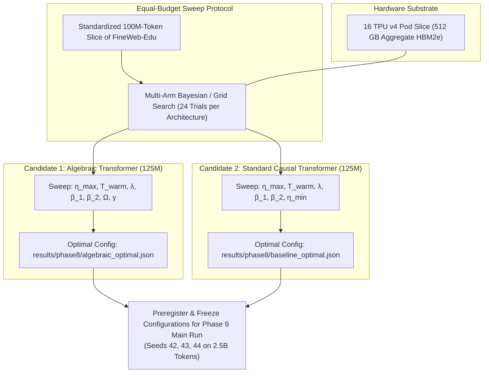

# Phase 8: Systematic Hyperparameter Sweeping & Architecture Tuning

Start only after Phase 7 PASS. Read `theory.md`, Phase 7 evidence in `results/phase7/`, and `phases/README.md` completely before executing. Execute the shared adaptive failure-repair loop until all gates pass.

---

## 1. Objective, Scientific Hypothesis & Competing Models

Conduct a rigorous, equal-budget **hyperparameter sweep and architecture tuning study** at the **125M parameter scale** on FineWeb-Edu to discover the globally optimal training configuration for both architectures prior to launching the 2.5B token pretraining campaign:
$$\textbf{"Can both the Algebraic Transformer and the Standard Transformer be tuned to their respective Pareto-optimal frontiers under equal search budgets to guarantee a fair, apples-to-apples comparison?"}$$

### Competing Hypotheses:
- **$H_1$ (Fair Calibration Hypothesis):** Independently sweeping optimization parameters (learning rate $\eta_{\max}$, warmup horizon $T_{\text{warm}}$, weight decay $\lambda$, optimizer momentum and second-moment smoothing, attention sink $\Omega$, and loss scaling $\gamma$) under identical evaluation token budgets on the 16 TPU v4 Pod isolates true architectural capability from hyperparameter sub-optimality. Both models enter Phase 9 pretraining with peak configuration efficiency, eliminating confounding tuning bias.
- **$H_0$ (Confounding Sensitivity Hypothesis):** Pure algebraic primitives are hypersensitive to hyperparameter selection, requiring disproportionate tuning effort or failing to achieve stable convergence across candidate grid points relative to well-established AdamW + Cosine baselines.

---

## 2. Equal-Budget Hyperparameter Search Protocol

To enforce strict scientific neutrality, both candidate architectures receive an **identical hyperparameter evaluation budget**:

### 2.1 Search Space Dimensions
Both architectures are evaluated across **24 randomized/grid search trials** on a standardized 100M-token split of FineWeb-Edu using the 16 TPU v4 Pod:

| Parameter | Pure Algebraic Transformer (`AlgebraicTransformerLM`) | Standard Causal Transformer (`StandardTransformerLM`) |
| :--- | :--- | :--- |
| **Peak Learning Rate ($\eta_{\max}$)** | $[1.0 \times 10^{-4}, 2.0 \times 10^{-3}]$ (Log-uniform) | $[1.0 \times 10^{-4}, 2.0 \times 10^{-3}]$ (Log-uniform) |
| **Warmup Steps ($T_{\text{warm}}$)** | $\{1000, 2000, 4000\}$ steps | $\{1000, 2000, 4000\}$ steps |
| **Decoupled Weight Decay ($\lambda$)** | $\{0.001, 0.01, 0.05, 0.10\}$ | $\{0.01, 0.05, 0.10, 0.15\}$ |
| **First-Moment Momentum ($\beta_1$)** | $\{0.85, 0.90, 0.95\}$ (Rational polynomial) | $\{0.85, 0.90, 0.95\}$ (Standard AdamW) |
| **Second-Moment Factor ($\beta_2$)** | $\{0.95, 0.98, 0.99, 0.999\}$ (Algebraic AdamW) | $\{0.95, 0.98, 0.99, 0.999\}$ (Standard AdamW) |
| **Attention Sink ($\Omega$)** | $\{0.1, 0.25, 0.5, 1.0, 2.0\}$ | N/A |
| **Loss Calibration Scale ($\gamma$)** | $\{1.0, 1.5, 2.0, 3.0\}$ (OACE multiplier) | N/A |
| **Schedule Minimum ($\eta_{\min}$)** | Asymptotic $\mathcal{O}(1/\sqrt{T})$ (ARDS) | $\{1.0 \times 10^{-5}, 5.0 \times 10^{-5}\}$ (Cosine) |

### 2.2 Objective Function & Selection Criterion
- **Primary Metric:** Validation loss / perplexity on held-out FineWeb-Edu validation split at the end of the 100M-token budget.
- **Secondary Constraints:**
  - Zero non-finite iterations ($\text{NaN} / \text{Inf} = 0$).
  - Maximum gradient norm throughout trajectory $\max_t \|\mathbf{g}_t\|_2 \le 5.0$.
  - Activation variance across layers stable within $[0.8, 1.3]$.

---

## 3. Implementation Target: JAX / TPU v4 Architecture

Instruct the creation and verification of the following files targeting the 16 TPU v4 Pod:
1. **`scripts/run_hparam_sweep.py`**:
   - Automated sweep orchestrator leveraging JAX SPMD sharding across 16 TPU v4 chips.
   - Executes trial configurations, logs intermediate loss curves, and records validation perplexity.
   - Emits structured artifacts:
     - `results/phase8/sweep_ledger.json` (Full ledger of all 48 evaluated trials).
     - `results/phase8/algebraic_optimal.json` (Best configuration for Algebraic Transformer).
     - `results/phase8/baseline_optimal.json` (Best configuration for Standard Transformer).
2. **`tests/test_hparam_contracts.py`**:
   - Automated tests ensuring that the selected hyperparameters satisfy all Zero-Transcendental constraints and budget parity rules.

---

## 4. Evaluation Suite & Statistical Verification

Evaluate the sweep results:
1. **Convergence Pareto Frontier:** Plot validation perplexity vs. peak learning rate $\eta_{\max}$ for both architectures, verifying smooth convex basin behavior without chaotic sensitivity.
2. **Gradient Stability Margin:** Confirm that the chosen optimal configurations maintain a minimum $2\times$ stability margin from the edge of divergence.
3. **Apples-to-Apples Parity Verification:** Confirm that parameter count parity ($\pm 1\%$), batch size ($1.05 \times 10^6$ tokens), and sequence context ($T=2048$) remain strictly matched.

---

## 5. Lean 4 Formal Verification Gate

Re-verify proof integrity for the optimal parameter bounds:
- Compile all modules in `formal/AlgebraicTheory/` via `/root/.elan/bin/lake build`.
- Confirm that the optimal learning rate $\eta_{\max}$ and decay parameter $\alpha$ satisfy the convergence conditions formalized in `formal/AlgebraicTheory/Curvature.lean`.

---

## 6. Adaptive Failure-Repair & Bidirectional Dependency Protocol

When an issue occurs during the hyperparameter sweep:
1. **Upstream Rollback:**
   - If all trials in the Algebraic Transformer sweep exhibit instability at sequence length 2048, backtrack to **Phase 2** (A-Softmax $\Omega$ bounding) or **Phase 1** (AVN residual depth attenuation $\operatorname{rsqrt}(2D)$).
   - If AdamW second moments exhibit late-stage instability, backtrack to **Phase 5** and adjust ARDS curvature scale $\alpha$ or learning rate warmup $T_{\text{warm}}$.
2. **Forward Dependency Cascading:**
   - The winning configurations saved in `results/phase8/algebraic_optimal.json` and `results/phase8/baseline_optimal.json` are **strictly frozen** and directly imported by **Phase 9** for the 6 pretraining runs across Seeds 42, 43, and 44.
   - No ad-hoc hyperparameter adjustments are permitted during Phase 9; any modification must be re-evaluated through Phase 8.

---

## 7. PASS Gates

- [ ] Complete 24 trials per architecture (48 trials total) on 100M tokens of FineWeb-Edu on 16 TPU v4 Pod without unhandled crashes.
- [ ] Pareto-optimal learning rates, warmup schedules, and decay factors identified with smooth basin geometry.
- [ ] Optimal configurations emit zero NaNs, zero Infs, and maximum gradient norm $\le 5.0$.
- [ ] Winning hyperparameters saved and frozen into `results/phase8/algebraic_optimal.json` and `results/phase8/baseline_optimal.json`.
- [ ] All Lean 4 formal proofs compile cleanly via `/root/.elan/bin/lake build`.
- [ ] All inherited Phase 1–7 gates pass without regression.
- [ ] `results/phase8/PASS.md` satisfies the shared PASS record contract.
