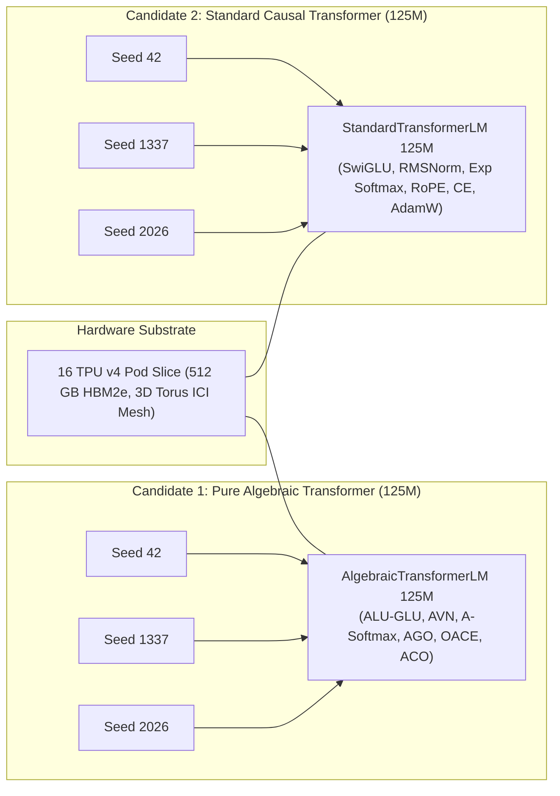

# Phase 8: Frontier Pretraining: 125M Parameters on 1.0B FineWeb-Edu Tokens

Start only after Phase 7 PASS. Read `theory.md`, Phase 7 evidence in `results/phase7/` and `phases/README.md` completely before executing. Execute the shared adaptive failure-repair loop until all gates pass.

---

## 1. Objective, Scientific Hypothesis & Competing Models

Execute the definitive empirical head-to-head pretraining comparison at the **125M parameter scale** across **1.0 Billion tokens of FineWeb-Edu** on the dedicated **16 TPU v4 Pod slice (512 GB aggregate HBM)**:
$$\textbf{"Can pure algebra match or exceed the standard causal Transformer at the 125M / 1.0B token frontier?"}$$

### Competing Hypotheses:
- **$H_1$ (Algebraic Hypothesis):** The 125M Pure Algebraic Transformer (`AlgebraicTransformerLM`) achieves validation perplexity parity ($\le 1.08\times$) and downstream zero-shot reasoning parity (within $2.0\%$ absolute margin on ARC-Easy, HellaSwag, PIQA, and LAMBADA) relative to the Standard Causal Transformer baseline across 3 paired seeds, while maintaining bounded gradient dynamics, zero loss spikes, and $\ge 45\%$ lower optimizer memory in local HBM.
- **$H_0$ (Transcendental Baseline Hypothesis):** On a large web corpus (1.0B tokens), continuous transcendental functions (Swish activation, exponential Softmax, RoPE trigonometric embeddings, cross-entropy $-\ln p$, and AdamW + Cosine schedule) provide essential inductive advantages that pure algebraic approximations cannot replicate, resulting in diverging validation loss, representation collapse, or severe downstream benchmark degradation.

---

## 2. Matched Multi-Seed Experimental Configuration & Budget Parity

Preregister and freeze the experimental configuration before launching training runs:

### 2.1 Model Specifications (125M Scale)
- **Parameter Count:** $\approx 125\text{M}$ parameters (matched within $\pm 1\%$ across architectures).
- **Hidden Dimension ($d_{\text{model}}$):** $768$.
- **Number of Layers ($L$):** $12$.
- **Attention Heads ($H$):** $12$ ($d_k = d_v = 64$ per head).
- **FFN Intermediate Dimension ($d_{\text{ff}}$):** $2048$ ($8/3 \times d_{\text{model}} \approx 2048$).
- **Vocabulary Size ($V$):** $50,257$ (GPT-2 standard BPE tokenizer).
- **Context Length ($T$):** $2048$ tokens.
- **Dataset:** Exactly **1.0 Billion training tokens** drawn from the **FineWeb-Edu** corpus (`HuggingFaceFW/fineweb-edu`).
- **Global Batch Size:** $\approx 1.05 \times 10^6$ tokens ($512$ sequences $\times 2048$ context length), distributed across the 16 TPU v4 chips via SPMD sharding.
- **Precision:** BF16 mixed-precision with FP32 master weights and optimizer state accumulation.
- **Checkpoint Cadence:** Checkpoints saved every $50\text{M}$ tokens.
- **Paired Seeds:** 3 identical random seeds (Seed 42, Seed 1337, Seed 2026), yielding $2 \times 3 = 6$ complete pretraining runs.

### 2.2 Budget Parity Enforcement
- Parameters within $\pm 1\%$.
- Exact same token streams and shard ordering across corresponding seeds.
- Identical optimizer step counts.
- SPMD distributed execution on 16 TPU v4 Pod slice over optical ICI interconnect.

---

## 3. Implementation Target: JAX / TPU v4 Architecture

Instruct the creation and verification of the following files targeting the 16 TPU v4 Pod:
1. **`scripts/run_pretrain_125m.py`**:
   - Multi-device distributed pretraining script for 125M parameter models across 1.0B FineWeb-Edu tokens on 16 TPU v4 chips.
   - SPMD mesh sharding via `src/mesh.py` (`data`, `fsdp` axes).
   - High-throughput dataset streaming pipeline using `tf.data` / Hugging Face datasets with deterministic shard hashing.
2. **`scripts/evaluate_benchmarks.py`**:
   - Zero-shot evaluation harness executing ARC-Easy, HellaSwag, PIQA, and LAMBADA.

---

## 4. Evaluation Suite & Statistical Protocol

Evaluate all 6 completed runs across the following four evaluation axes:

### 4.1 Language Modeling Perplexity
- Validation perplexity and loss on held-out FineWeb-Edu validation split.
- Report mean $\pm$ standard error of the mean (SEM) and 95% confidence intervals across the 3 paired seeds.

### 4.2 Downstream Zero-Shot Reasoning Benchmarks
Evaluate checkpoints using standard zero-shot reasoning probes:
- **ARC-Easy:** Elementary science reasoning.
- **HellaSwag:** Grounded commonsense reasoning.
- **PIQA:** Physical interaction question answering.
- **LAMBADA:** Broad narrative context word prediction.
- Report mean accuracy $\pm$ SEM across seeds. Parity bound: within $2.0\%$ absolute margin of the baseline.

### 4.3 Training Stability Dynamics
- Maximum gradient norm: $\max_{t} \|\mathbf{g}_t\|_2$ over the entire 1.0B token trajectory.
- Count of sudden loss spikes ($\Delta \mathcal{L} > 1.5$) and non-finite iterations ($0$ permitted).
- Hidden activation variance tracking across all 12 layers: verify that parameter-free AVN maintains $\operatorname{Var}(\mathbf{h}_\ell) \in [0.8, 1.3]$ without gain drift.

### 4.4 Systems & Efficiency Telemetry on 16 TPU v4 Pod
- Sustained training throughput (tokens/second) on 16 TPU v4 chips.
- Peak HBM memory allocation during training.
- Optimizer memory state bytes: Confirm that ACO reduces second-moment memory from $\approx 500\text{ MB}$ to $< 1\text{ MB}$, saving $\ge 45\%$ total optimizer memory in HBM.

---

## 5. Lean 4 Formal Verification Gate

Re-verify formal proof integrity under parameter scaling:
- Compile all modules in `formal/AlgebraicTheory/` via `/root/.elan/bin/lake build`.
- Verify that dimensional scaling ($d_{\text{model}} = 768$, $L = 12$) preserves all algebraic Lipschitz bounds, variance bounds, and loss propriety theorems.

---

## 6. Adaptive Failure-Repair & Bidirectional Dependency Protocol

When an issue occurs at the 125M frontier:
1. **Upstream Dependency Rollback:**
   - If attention entropy collapses at context length 2048, backtrack to **Phase 2**, calibrate query-key scale factor $\tau = \operatorname{rsqrt}(d_k)$ and attention sink $\Omega \in [0.25, 1.0]$.
   - If a downstream reasoning gap $> 2.0\%$ appears, backtrack to **Phase 5**, implement rational polynomial debiasing factors in ACO $\hat{\mathbf{m}}_t / (1 - \beta_1^t)$.
   - Re-run upstream verification gates, update Lean 4 proofs, and forward-cascade through intermediate phases back to Phase 8.
2. **Forward Dependency Cascading:**
   - Any architectural calibration or optimizer refinement validated during Phase 8 must be immediately forwarded into **Phase 9 (350M scale)**.
   - Checkpoint formats and evaluation routines must maintain backwards and forwards compatibility.

---

## 7. PASS Gates

- [ ] All 6 pretraining runs (2 architectures $\times$ 3 seeds) complete the full 1.0B token budget with zero unhandled NaNs or divergent loss spikes.
- [ ] Algebraic Transformer validation perplexity on FineWeb-Edu achieves parity with the Standard Transformer baseline within $\le 1.08\times$ (mean over 3 paired seeds).
- [ ] Perplexity variance across seeds is low and stable: $\operatorname{SEM} \le 0.15$.
- [ ] Downstream zero-shot reasoning benchmarks (ARC-Easy, HellaSwag, PIQA, LAMBADA) are within $2.0\%$ absolute margin of the Standard Transformer baseline.
- [ ] Hardware measurements on 16 TPU v4 Pod confirm $\ge 45\%$ lower optimizer memory footprint for ACO compared to AdamW.
- [ ] Strict Zero-Transcendental audit confirms 0 transcendental function calls across all 125M Algebraic checkpoints and training traces.
- [ ] All Lean 4 formal proofs compile cleanly via `/root/.elan/bin/lake build`.
- [ ] All inherited Phase 1–7 gates pass without regression.
- [ ] `results/phase8/PASS.md` satisfies the shared PASS record contract with complete reproduction logs.
