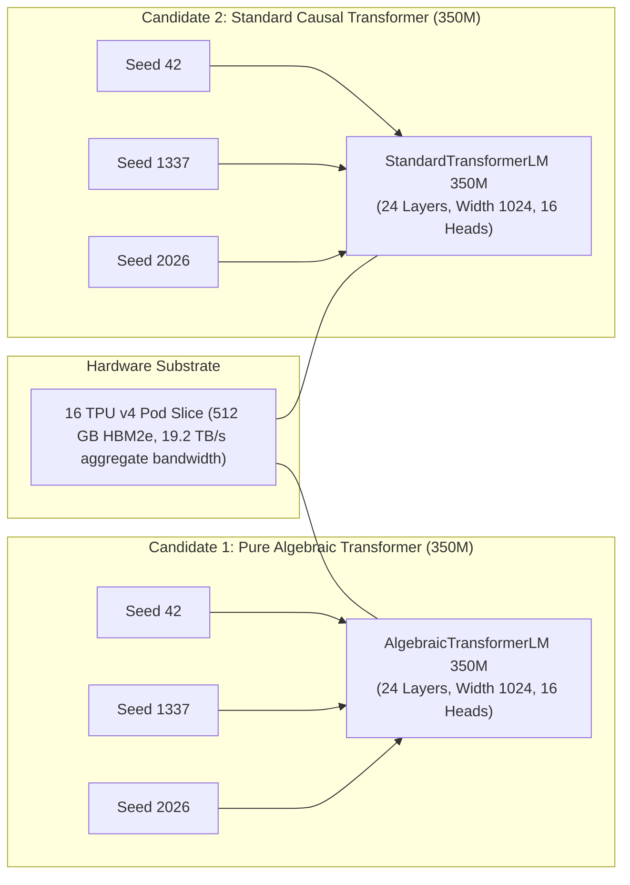
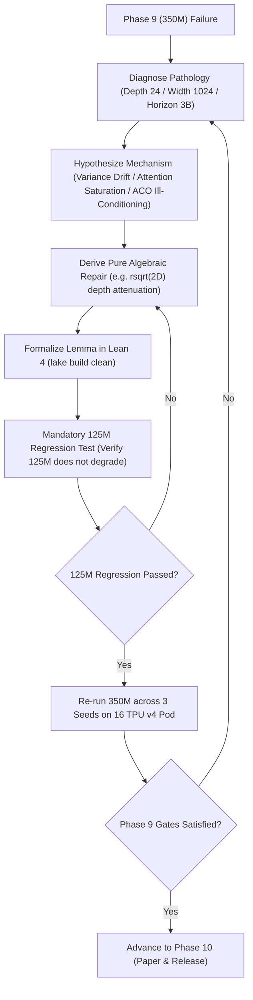

# Phase 9: Scaled Frontier Pretraining: 350M Parameters on 3.0B FineWeb-Edu Tokens & Scaling Laws

Start only after Phase 8 PASS. Read `theory.md`, Phase 7 & 8 evidence in `results/phase7/` and `results/phase8/`, and `phases/README.md` completely before executing. Execute the shared adaptive failure-repair loop until all gates pass.

---

## 1. Objective, Scientific Hypothesis & Competing Models

Scale model capacity to **350M parameters** ($2\times$ depth, 24 layers, width 1024) and pretrain on **3.0 Billion tokens of FineWeb-Edu** on the dedicated **16 TPU v4 Pod slice (512 GB aggregate HBM)**:
$$\textbf{"Do pure algebraic transformers obey neural power-law scaling and maintain deep 24-layer stability?"}$$

### Competing Hypotheses:
- **$H_1$ (Algebraic Hypothesis):** Pure algebraic Transformers obey empirical neural scaling laws ($L(N) \propto N^{-\alpha}$), exhibiting scaling exponents matching or exceeding the Standard Causal Transformer baseline ($\alpha_{\text{alg}} \approx \alpha_{\text{base}}$). Parameter-free AVN suppresses exponential variance drift across 24 stacked layers ($(1.0445)^{24} \approx 2.87$ maximum theoretical bound), and AGO Cayley rotations generalize across context lengths $\ge 4096$ tokens without positional distortion.
- **$H_0$ (Transcendental Baseline Hypothesis):** At 24 layers and 3.0B tokens, the lack of transcendental non-linearities (e.g. Swish, Softmax) will cause representation degradation, cumulative variance distortion, or attention entropy collapse, breaking power-law scaling and causing loss divergence or plateauing relative to the transcendental baseline.

---

## 2. Matched Multi-Seed Experimental Configuration & Budget Parity

Preregister and freeze the 350M configuration:

### 2.1 Model Specifications (350M Scale)
- **Parameter Count:** $\approx 350\text{M}$ parameters (matched within $\pm 1\%$ across architectures).
- **Hidden Dimension ($d_{\text{model}}$):** $1024$.
- **Number of Layers ($L$):** $24$ ($2\times$ depth of Phase 8).
- **Attention Heads ($H$):** $16$ ($d_k = d_v = 64$ per head).
- **FFN Intermediate Dimension ($d_{\text{ff}}$):** $2816$ ($8/3 \times d_{\text{model}} \approx 2816$ rounded to multiple of 128 for TPU v4 MXU efficiency).
- **Vocabulary Size ($V$):** $50,257$ (GPT-2 standard BPE tokenizer).
- **Context Length ($T$):** $2048$ tokens (with evaluation up to $8192$ for NIAH).
- **Dataset:** Exactly **3.0 Billion training tokens** drawn from **FineWeb-Edu**.
- **Hardware Target:** Dedicated 16 TPU v4 Pod slice (32 TensorCores, 512 GB aggregate HBM2e).
- **Global Batch Size:** $\approx 1.05 \times 10^6$ tokens ($512$ sequences $\times 2048$ context length), distributed across the 16 TPU v4 chips via SPMD mesh sharding (`data`, `fsdp`).
- **Precision:** BF16 mixed-precision with FP32 master weights.
- **Checkpoint Cadence:** Checkpoints saved every $100\text{M}$ tokens.
- **Paired Seeds:** 3 identical random seeds (Seed 42, Seed 1337, Seed 2026), yielding $2 \times 3 = 6$ complete pretraining runs.

---

## 3. Implementation Target: JAX / TPU v4 Architecture

Instruct the creation and verification of the following files targeting the 16 TPU v4 Pod:
1. **`scripts/run_pretrain_350m.py`**:
   - Scaled pretraining script for 350M parameter models across 3.0B tokens on 16 TPU v4 chips.
   - SPMD distributed parallelism utilizing 3D Torus mesh sharding (`src/mesh.py`).
2. **`scripts/evaluate_scaling_laws.py`**:
   - Automated power-law curve fitting across 15M (Phase 7), 125M (Phase 8), and 350M (Phase 9) checkpoints.
   - Multi-needle passkey retrieval (Needle-In-A-Haystack) suite across context lengths $\{2048, 4096, 8192\}$.

---

## 4. Scaling Law Analysis & Deep 24-Layer Stability

Evaluate all completed 350M runs across:

### 4.1 Empirical Neural Scaling Laws
- Measure loss reduction $\Delta \mathcal{L} = \mathcal{L}_{125\text{M}} - \mathcal{L}_{350\text{M}}$ from Phase 8 to Phase 9.
- Confirm parallel power-law scaling: verify that the Algebraic Stack exhibits a scaling exponent $\alpha$ matching or exceeding the Standard Transformer baseline ($L(N) \propto N^{-\alpha}$).
- Fit parametric scaling curves $L(N) = L_\infty + A \cdot N^{-\alpha}$ across the 15M (Phase 7), 125M (Phase 8), and 350M (Phase 9) checkpoints.

### 4.2 Deep 24-Layer Stability & Signal Propagation
- Track activation variance $\operatorname{Var}(\mathbf{h}_\ell)$ across all 24 layers from layer 1 to 24.
- Verify that parameter-free AVN prevents exponential signal amplification across 24 layers ($(1.0445)^{24} \approx 2.87$ maximum theoretical drift).
- Confirm zero loss spikes ($\Delta \mathcal{L} > 1.5$) and zero gradient explosions over the entire 3.0B token trajectory.

### 4.3 Long-Context Retrieval & Needle-In-A-Haystack (NIAH)
- Multi-needle passkey retrieval benchmarks across context lengths $\{2048, 4096, 8192\}$.
- Confirm that AGO Cayley rotations maintain $\ge 90\%$ needle retrieval accuracy at extended context lengths.

### 4.4 Systems & Efficiency Telemetry on 16 TPU v4 Pod
- Prefill throughput (tok/s) and per-token decode latency (ms/tok).
- Peak HBM memory allocation.
- Optimizer memory state bytes: Verify factorized second-moment compression of $\approx 2048\times$ at width 1024, saving $> 45\%$ total optimizer memory in HBM.

---

## 5. The Hierarchical Scaling Back-Propagation Loop

If the 125M model succeeded in Phase 8, but the 350M model fails in Phase 9, the autonomous agent must execute the **Hierarchical Scaling Back-Propagation Protocol**:

### Specific 350M Diagnostics:
1. **Vanishing / Exploding Gradients Across 24 Layers:** Apply rational depth attenuation:
   $$\mathbf{x}_{\ell+1} = \mathbf{x}_\ell + \operatorname{rsqrt}(2 D) \cdot \operatorname{SubLayer}(\operatorname{AVN}(\mathbf{x}_\ell))$$
2. **Attention Entropy Saturation at Width $d=1024$:** Calibrate query-key scale factor $\tau = \frac{1}{\sqrt{d_k}} \operatorname{rsqrt}(1 + \mu)$ or adjust attention sink $\Omega$.
3. **ACO Preconditioner Ill-Conditioning:** Enforce algebraic diagonal damping $\hat{\mathbf{V}}_{ij} \leftarrow \hat{\mathbf{V}}_{ij} + \epsilon_{\text{curv}} \bar{r} \mathbf{I}$.
4. **Mandatory 125M Regression Check:** Any change made to fix 350M must be evaluated on the 125M model to confirm zero performance regression. Both scales must simultaneously pass.

---

## 6. Lean 4 Formal Verification Gate

Compile all Lean 4 modules via `/root/.elan/bin/lake build`:
- Verify that 24-layer composition theorems hold without `sorry`.
- Confirm formal proof coverage in `formal/PROOF_COVERAGE.md`.

---

## 7. PASS Gates

- [ ] All 3 random seed runs for 350M Algebraic Transformer and 350M Baseline Transformer complete the full 3.0B token budget with zero unhandled NaNs or divergence.
- [ ] Algebraic Transformer validation perplexity achieves parity with the Standard Transformer baseline within $\le 1.08\times$ (mean over 3 seeds).
- [ ] Parallel power-law scaling confirmed: Loss reduction from 125M to 350M satisfies $\Delta \mathcal{L}_{\text{alg}} \approx \Delta \mathcal{L}_{\text{base}}$.
- [ ] Zero loss spikes ($\Delta \mathcal{L} > 1.5$) or gradient explosions across all 24 layers over 3.0B tokens.
- [ ] Multi-needle passkey retrieval achieves $\ge 90.0\%$ accuracy at context lengths $\ge 4096$ tokens.
- [ ] Hardware measurements confirm $\ge 45\%$ lower total optimizer memory footprint for ACO vs. AdamW at 350M scale.
- [ ] Mandatory 125M regression check passes with zero performance degradation.
- [ ] All Lean 4 formal proofs compile cleanly via `/root/.elan/bin/lake build`.
- [ ] All inherited Phase 1–8 gates pass without regression.
- [ ] `results/phase9/PASS.md` satisfies the shared PASS record contract.
