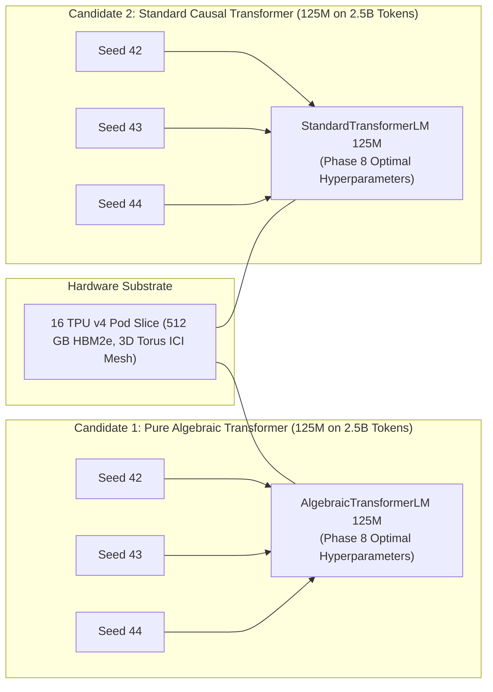

# Phase 9: Frontier Pretraining: 125M Parameters on 2.5B FineWeb-Edu Tokens (Seeds 42, 43, 44)

Start only after Phase 8 PASS. Read `theory.md`, Phase 8 optimal hyperparameters in `results/phase8/`, and `phases/README.md` completely before executing. Execute the shared adaptive failure-repair loop until all gates pass.

---

## 1. Objective, Scientific Hypothesis & Competing Models

Execute the definitive empirical head-to-head pretraining comparison at the **125M parameter scale** across **2.5 Billion tokens of FineWeb-Edu** on the dedicated **16 TPU v4 Pod slice (512 GB aggregate HBM)** using the preregistered, sweep-optimized hyperparameters from Phase 8:
$$\textbf{"Can pure algebra match or exceed the standard causal Transformer at the 125M / 2.5B token frontier under fair, apples-to-apples tuning?"}$$

### Competing Hypotheses:
- **$H_1$ (Algebraic Hypothesis):** The 125M Pure Algebraic Transformer (`AlgebraicTransformerLM`) trained with Phase 8 optimal hyperparameters achieves validation perplexity parity ($\le 1.08\times$) and downstream zero-shot reasoning parity (within $2.0\%$ absolute margin on ARC-Easy, HellaSwag, PIQA, and LAMBADA) relative to the Standard Causal Transformer baseline across **Seeds 42, 43, and 44** over 2.5B tokens, while maintaining bounded gradient dynamics, zero loss spikes, and $\ge 45\%$ lower optimizer memory in local HBM.
- **$H_0$ (Transcendental Baseline Hypothesis):** On a large web corpus (2.5B tokens), continuous transcendental functions (Swish activation, exponential Softmax, RoPE trigonometric embeddings, cross-entropy $-\ln p$, and AdamW + Cosine schedule) provide essential inductive advantages that pure algebraic approximations cannot replicate even after systematic hyperparameter tuning, resulting in diverging validation loss, representation collapse, or severe downstream benchmark degradation.

---

## 2. Matched Multi-Seed Experimental Configuration & Budget Parity (6 Runs Total)

Preregister and freeze the experimental configuration before launching training runs:

### 2.1 Model Specifications (125M Scale)
- **Parameter Count:** $\approx 125\text{M}$ parameters (matched within $\pm 1\%$ across architectures).
- **Hidden Dimension ($d_{\text{model}}$):** $768$.
- **Number of Layers ($L$):** $12$.
- **Attention Heads ($H$):** $12$ ($d_k = d_v = 64$ per head).
- **FFN Intermediate Dimension ($d_{\text{ff}}$):** $2048$ ($8/3 \times d_{\text{model}} \approx 2048$, aligned to multiples of 128 for TPU v4 MXU efficiency).
- **Vocabulary Size ($V$):** $50,257$ (GPT-2 standard BPE tokenizer).
- **Context Length ($T$):** $2048$ tokens.
- **Dataset:** Exactly **2.5 Billion training tokens** drawn from the **FineWeb-Edu** corpus (`HuggingFaceFW/fineweb-edu`).
- **Global Batch Size:** $\approx 1.05 \times 10^6$ tokens ($512$ sequences $\times 2048$ context length), distributed across the 16 TPU v4 chips via SPMD sharding (`data`, `fsdp` axes).
- **Precision:** BF16 mixed-precision with FP32 master weights and optimizer state accumulation.
- **Checkpoint Cadence:** Checkpoints saved every $100\text{M}$ tokens.
- **Paired Seeds:** 3 identical random seeds (**Seed 42, Seed 43, Seed 44**), yielding $2 \text{ architectures} \times 3 \text{ seeds} = \mathbf{6\text{ complete pretraining runs}}$ of 2.5B tokens each.
- **Hyperparameter Injection:**
  - `AlgebraicTransformerLM` imports `results/phase8/algebraic_optimal.json`.
  - `StandardTransformerLM` imports `results/phase8/baseline_optimal.json`.

### 2.2 Budget Parity Enforcement
- Parameters matched within $\pm 1\%$.
- Identical token streams and shard ordering across corresponding seeds.
- Identical optimizer step counts (~2,384 steps at batch size $1.05 \times 10^6$ tokens).
- SPMD distributed execution on 16 TPU v4 Pod slice over optical ICI interconnect.

---

## 3. Implementation Target: JAX / TPU v4 Architecture

Instruct the creation and verification of the following files targeting the 16 TPU v4 Pod:
1. **`scripts/run_pretrain_125m.py`**:
   - Multi-device distributed pretraining script for 125M parameter models across 2.5B FineWeb-Edu tokens on 16 TPU v4 chips.
   - Automatically loads hyperparameters from `results/phase8/`.
   - SPMD mesh sharding via `src/mesh.py` (`data`, `fsdp` axes).
   - High-throughput dataset streaming pipeline using `tf.data` / Hugging Face datasets with deterministic shard hashing.
   - CLI flags: `--architecture {algebraic, standard} --seed {42, 43, 44} --total_tokens 2500000000`.
2. **`scripts/evaluate_benchmarks.py`**:
   - Zero-shot evaluation harness executing ARC-Easy, HellaSwag, PIQA, and LAMBADA.

---

## 4. Evaluation Suite & Statistical Protocol

Evaluate all 6 completed runs across the following four evaluation axes:

### 4.1 Language Modeling Perplexity
- Validation perplexity and loss on held-out FineWeb-Edu validation split.
- Report mean $\pm$ standard error of the mean (SEM) and 95% confidence intervals across the 3 paired seeds (42, 43, 44).

### 4.2 Downstream Zero-Shot Reasoning Benchmarks
Evaluate checkpoints using standard zero-shot reasoning probes:
- **ARC-Easy:** Elementary science reasoning.
- **HellaSwag:** Grounded commonsense reasoning.
- **PIQA:** Physical interaction question answering.
- **LAMBADA:** Broad narrative context word prediction.
- Report mean accuracy $\pm$ SEM across seeds. Parity bound: within $2.0\%$ absolute margin of the baseline.

### 4.3 Training Stability Dynamics
- Maximum gradient norm: $\max_{t} \|\mathbf{g}_t\|_2$ over the entire 2.5B token trajectory.
- Count of sudden loss spikes ($\Delta \mathcal{L} > 1.5$) and non-finite iterations ($0$ permitted).
- Hidden activation variance tracking across all 12 layers: verify that parameter-free AVN maintains $\operatorname{Var}(\mathbf{h}_\ell) \in [0.8, 1.3]$ without gain drift across 2.5B tokens.

### 4.4 Systems & Efficiency Telemetry on 16 TPU v4 Pod
- Sustained training throughput (tokens/second) on 16 TPU v4 chips.
- Peak HBM memory allocation during training.
- Optimizer memory state bytes: Confirm that ACO reduces second-moment memory from $\approx 500\text{ MB}$ to $< 1\text{ MB}$, saving $\ge 45\%$ total optimizer memory in HBM.

---

## 5. Lean 4 Formal Verification Gate

Re-verify formal proof integrity under parameter scaling:
- Compile all modules in `formal/AlgebraicTheory/` via `/root/.elan/bin/lake build`.
- Verify that dimensional scaling ($d_{\text{model}} = 768$, $L = 12$) preserves all algebraic Lipschitz bounds, variance bounds, and loss propriety theorems.

---

## 6. Adaptive Failure-Repair & Bidirectional Dependency Protocol

When an issue occurs during 125M / 2.5B token pretraining:
1. **Upstream Dependency Rollback:**
   - If convergence pathology arises on a specific seed, backtrack to **Phase 8** to inspect whether the hyperparameter selection was too close to an instability boundary.
   - If attention entropy collapses at context length 2048, backtrack to **Phase 2**, calibrate query-key scale factor $\tau = \operatorname{rsqrt}(d_k)$ and attention sink $\Omega \in [0.25, 1.0]$.
   - Re-run upstream verification gates, update Lean 4 proofs, and forward-cascade through intermediate phases back to Phase 9.
2. **Forward Dependency Cascading:**
   - Pretrained checkpoints, loss curves, and evaluation metrics are forwarded directly into **Phase 10 (Paper Finalization & Clean-Room Replication)**.

---

## 7. PASS Gates

- [ ] All 6 pretraining runs (2 architectures $\times$ 3 seeds: 42, 43, 44) complete the full 2.5B token budget with zero unhandled NaNs or divergent loss spikes.
- [ ] Algebraic Transformer validation perplexity on FineWeb-Edu achieves parity with the Standard Transformer baseline within $\le 1.08\times$ (mean over Seeds 42, 43, 44).
- [ ] Perplexity variance across seeds is low and stable: $\operatorname{SEM} \le 0.15$.
- [ ] Downstream zero-shot reasoning benchmarks (ARC-Easy, HellaSwag, PIQA, LAMBADA) are within $2.0\%$ absolute margin of the Standard Transformer baseline.
- [ ] Hardware measurements on 16 TPU v4 Pod confirm $\ge 45\%$ lower optimizer memory footprint for ACO compared to AdamW.
- [ ] Strict Zero-Transcendental audit confirms 0 transcendental function calls across all 125M Algebraic checkpoints and training traces.
- [ ] All Lean 4 formal proofs compile cleanly via `/root/.elan/bin/lake build`.
- [ ] All inherited Phase 1–8 gates pass without regression.
- [ ] `results/phase9/PASS.md` satisfies the shared PASS record contract with complete reproduction logs.
