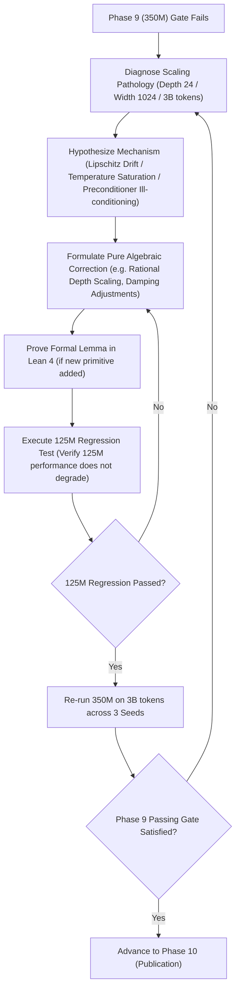

# Phase 9: Scaled Frontier Pretraining: 350M Parameters on 3B Tokens of FineWeb-Edu (3 Seeds on 1x MI300X)

## 1. Objective & Research Scope
Validate neural scaling laws for pure algebraic architectures by scaling parameters by $\approx 3\times$ ($125\text{M} \to 350\text{M}$), depth by $2\times$ ($12 \to 24\text{ layers}$), and training tokens by $3\times$ ($1\text{B} \to 3\text{B tokens}$):
$$\textbf{"Does pure algebraic intelligence scale predictably and stably as depth and capacity expand?"}$$

Train a **350M-parameter Pure Algebraic Transformer** alongside a **standard 350M Transformer baseline** on **3 Billion tokens of FineWeb-Edu** across **three independent random seeds** (Seeds 42, 1337, 2026) strictly utilizing this server's **1x AMD Instinct MI300X (192 GB HBM3)**:
- Total runs: $2 \text{ architectures} \times 3 \text{ seeds} = 6 \text{ complete scaling runs}$.
- Compute mean $\pm$ standard error of the mean (SEM) for all scaling metrics.
- Establish whether pure algebraic deep neural networks obey predictable power-law scaling without transcendental saturation or depth-induced gradient degradation.

---

## 2. Experimental Setup on 1x AMD Instinct MI300X

### 2.1 Hardware Allocation & High-Throughput Execution
- **Accelerator:** 1x AMD Instinct MI300X GPU (`gfx942`, 192 GB HBM3, 5.3 TB/s bandwidth).
- **VRAM Footprint at 350M:**
  - 350M parameters in BF16: $700\text{ MB}$ weights, $700\text{ MB}$ gradients.
  - ACO state: $700\text{ MB}$ (first moment) $+ 3.2\text{ MB}$ (factorized row/col marginals) $\approx 703.2\text{ MB}$.
  - Total static state: $< 2.2\text{ GB}$.
  - **Memory Headroom:** Over $189\text{ GB}$ of local HBM3 is available for high-throughput batching, enabling sequence length 2048 with global batch size $\approx 1.5\text{M}$ tokens per step without any multi-node synchronization latency.
- **Seeds:** Seed 42, Seed 1337, Seed 2026 for both models.

### 2.2 Model Specifications (350M Parameters)
| Hyperparameter | Algebraic Transformer (Ours) | Standard Transformer Baseline |
| :--- | :--- | :--- |
| **Layers (Depth)** | **24** | **24** |
| **Hidden Dimension ($d$)** | **1024** | **1024** |
| **Attention Heads** | 16 | 16 |
| **Head Dimension ($d_k$)** | 64 | 64 |
| **FFN Intermediate Dimension** | 2816 (ALU-GLU) | 2816 (SwiGLU) |
| **Sequence Length** | 2048 | 2048 |
| **Activation** | ALU ($x \cdot \beta(x)$) | GELU ($x \cdot \Phi(x)$) |
| **Attention Mechanism** | A-Softmax ($\kappa_8(x)$, $\Omega=1.0$) | Exponential Softmax ($\exp(x)$) |
| **Positional Representation** | AGO (Rational Cayley $\mathrm{SO}(2)$) | RoPE ($\cos m\theta, \sin m\theta$) |
| **Normalization** | AVN ($\mathbf{x} \cdot \operatorname{rsqrt}(m_2 + \epsilon)$) | RMSNorm |
| **Loss Functional** | OACE ($\mathcal{L}_{1/8}$) | Cross-Entropy ($-\sum y \ln p$) |
| **Optimizer** | ACO (Factorized $\mathcal{O}(d_{\text{out}} + d_{\text{in}})$) | AdamW ($\beta_1=0.9, \beta_2=0.95, \lambda=0.1$) |
| **Learning Rate Schedule** | ARDS ($\eta_0 \cdot \operatorname{rsqrt}(1 + \alpha t^2)$) | Cosine Annealing |

---

## 3. Empirical Passing Gate & Acceptance Criteria (3-Seed Mean)

To satisfy Phase 9, the scaling runs across the 3 seeds must meet:

| Evaluation Dimension | Metric (Mean over 3 Seeds) | Success Threshold vs. Transformer Baseline |
| :--- | :--- | :--- |
| **Validation Perplexity** | Perplexity on FineWeb-Edu test set | $\frac{\operatorname{Mean\ PPL}_{\text{alg}}}{\operatorname{Mean\ PPL}_{\text{base}}} \leq 1.08$ (within 8% parity) |
| **Scaling Trajectory** | Loss reduction from $125\text{M} \to 350\text{M}$ | $\Delta \mathcal{L}_{\text{alg}} \approx \Delta \mathcal{L}_{\text{base}}$ (parallel power-law scaling) |
| **Perplexity Variance** | Standard Error of Mean (SEM) | $\operatorname{SEM} \leq 0.12$ across seeds |
| **Deep Network Stability** | Loss spikes / NaNs over 3B tokens across 24 layers | Exactly $0$ |
| **Downstream Zero-Shot** | ARC-Easy, HellaSwag, PIQA, MMLU | Mean accuracy within $2.0\%$ absolute of baseline |
| **VRAM Advantage on MI300X** | Total GPU memory consumption | $\geq 45\%$ lower optimizer memory footprint than AdamW |
| **Zero Transcendental Audit** | AST & memory check on all checkpoints | Exactly $0$ transcendental operations |

---

## 4. Hierarchical Scaling Back-Propagation Loop

### If Phase 8 Succeeded, but Phase 9 (350M) Fails:
The autonomous agent **MUST NOT PROCEED TO PHASE 10 (PAPER)**. 
A failure at 350M indicates a **depth-scaling, width-scaling, or horizon-scaling pathology**. The agent must execute the **Hierarchical Scaling Back-Propagation Protocol**:

### Specific 350M Diagnostics & Playbook:
1. **Pathology 1: Vanishing / Exploding Gradients Across 24 Layers:**
   - *Mechanism:* ALU is $L_K$-Lipschitz with $L_K \approx 1.0445$. Over $D = 24$ layers, un-damped residual accumulation can amplify signals by $(1.0445)^{24} \approx 2.87$.
   - *Algebraic Correction:* Apply a rational depth attenuation factor on residual branches:
     $$\mathbf{x}_{\ell+1} = \mathbf{x}_\ell + \operatorname{rsqrt}(2 D) \cdot \operatorname{SubLayer}(\operatorname{AVN}(\mathbf{x}_\ell))$$
     preserving strict variance bounds across arbitrary network depth.
2. **Pathology 2: Attention Entropy Saturation at Width $d=1024$:**
   - *Mechanism:* As hidden dimension increases from 768 to 1024, dot product variance increases, pushing octic kernel $\kappa_8$ into saturation.
   - *Algebraic Correction:* Calibrate query-key scale factor to $\tau = \frac{1}{\sqrt{d_k}} \cdot \frac{1}{\sqrt{1 + \mu}}$ where $\mu$ is an algebraic tuning scalar, or adaptively scale the attention sink constant $\Omega$.
3. **Pathology 3: ACO Curvature Preconditioner Ill-Conditioning at $1024 \times 1024$:**
   - *Mechanism:* In larger matrices, the rank-1 outer product $\hat{\mathbf{V}}_{ij} = \frac{\hat{r}_i \hat{c}_j}{\bar{r}}$ may encounter near-zero marginal entries in dormant features.
   - *Algebraic Correction:* Enforce algebraic diagonal damping: $\hat{\mathbf{V}}_{ij} \leftarrow \hat{\mathbf{V}}_{ij} + \epsilon_{\text{curv}} \bar{r} \mathbf{I}$, guaranteeing positive definiteness.
4. **Mandatory 125M Regression Check:**
   - Any architectural or optimizer adjustment made to fix 350M **must be evaluated on the 125M model** to confirm it does not induce performance regressions at the lower scale.
   - Both scales must simultaneously satisfy their respective acceptance gates.

---

## 5. Passing Gate Checklist
- [ ] 3 random seed pretraining runs completed for 350M Algebraic model on 3B tokens.
- [ ] 3 random seed pretraining runs completed for 350M Baseline Transformer on 3B tokens.
- [ ] Statistical significance table (mean $\pm$ SEM) logged for perplexity and benchmarks.
- [ ] Parallel power-law scaling trajectory confirmed from 125M to 350M.
- [ ] 125M regression test passed without degradation.
- [ ] Strict zero-transcendental compliance confirmed on all 350M checkpoints.
